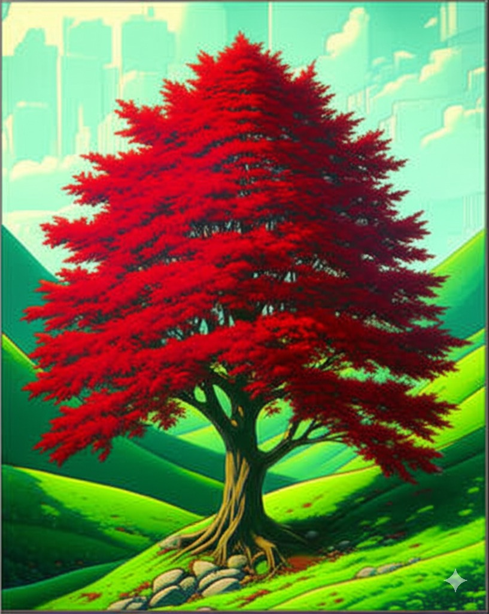

Current rankings suggest Midjourney as the top tool, followed by ChatGPT Image Generation (GPT-4o), Google's Imagen, Adobe Firefly, Stable Diffusion, Leonardo AI, and Flux. Beware, other tools may produce noticeably less natural images.

<!--endintro-->

## Midjourney

Midjourney generates high-quality images via Discord (/imagine command) or its new web interface.

* Cost: Starts at $10 USD/month ($8/month annually)
* Offers subscription tiers with GPU hours and commercial usage options
* Supports detailed prompts for customized images

::: img-medium

:::

## ChatGPT Image Generation (GPT-4o)

Integrated into ChatGPT for detailed, realistic image generation from text prompts.

* Direct access via ChatGPT
* Handles complex prompts seamlessly

::: img-large

:::

## Google Imagen

Offers exceptional photorealism and language comprehension.

* Accessible via Vertex AI or ImageFX
* Produces highly detailed, realistic images

## Adobe Firefly

Known for detailed control over image generation and editing, ideal for customized outputs.

* Advanced editing and generation features
* Integrated into Adobe Creative Cloud

::: img-large

:::

## Stable Diffusion (via DreamStudio)

Highly customizable, open source tool offering fine-tuned image generation.

* Free and available for local use
* Highly customizable with flexible output adjustments
* Supports inpainting and outpainting with Stable Diffusion XL (SDXL)

::: img-large

:::

## Leonardo AI

Known for imaginative visuals and concept art. Free account available at Leonardo.ai.

* User-friendly website
* Highly customizable with built-in image editing and prompt generation

::: img-medium

:::

## Flux

Developed by Black Forest Labs, Flux generates high-quality images from text prompts.

* Multiple model variants (Schnell, Dev, Pro)
* Supports various artistic styles and precise color control
* Capable of rendering text within images

::: img-large

:::
