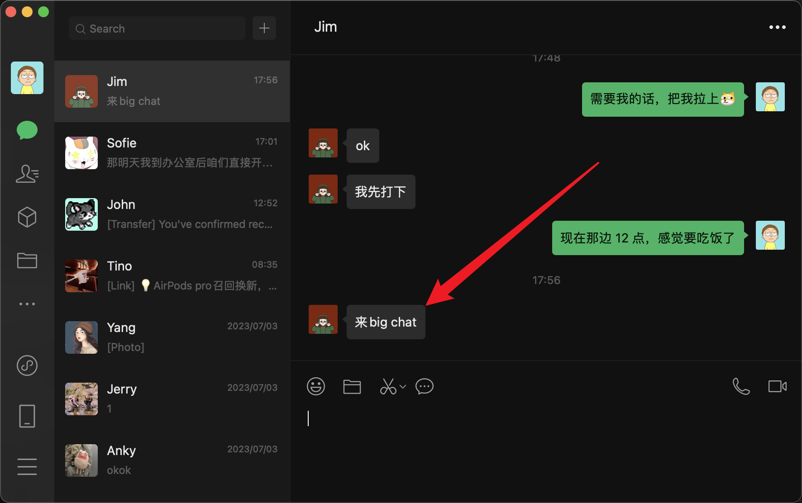

There are many tools used to communicate and collaborate online. The most efficient platforms for chats and calls are:

<!--endintro-->

* **[Teams](https://products.office.com/en-ca/microsoft-teams/group-chat-software)**
* **[Skype](https://www.skype.com/)**
* **[Slack](https://slack.com/)**

We think [Viva Engage](https://www.yammer.com/) could soon be decommissioned to reduce confusion.

::: china
In China:

* **[WeChat](https://www.wechat.com/)** (personal)
* **[DingTalk](https://www.dingtalk.com/en)** (businesses)
* **[WeCom](https://work.weixin.qq.com/)** (businesses)
:::

::: bad

:::