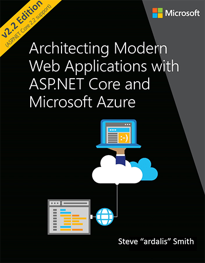

There are many great resources for learning the principles of Clean Architecture, but a the best place to start is with Jason Taylor’s video:

`youtube: https://www.youtube.com/embed/5OtUm1BLmG0`
 
 **Figure: Clean Architecture with ASP.NET Core 3.0 <mark>(Recommended)</mark>** 

`youtube: https://www.youtube.com/embed/_lwCVE_XgqI`
 

 **Figure: Clean Architecture with ASP.NET Core 2.1
** 
To read further, start with Robert C Martin’s blog post:        [The Clean Architecture](http://blog.cleancoder.com/uncle-bob/2012/08/13/the-clean-architecture.html).

<!--endintro-->

Then, check out these books:

This book by Robert C. Martin (aka ‘Uncle Bob’) should be anyone’s starting point for reading further.

  

This resource by Steve Smith is available as an online e-book and contains up-to-date specific examples for ASP.NET Core and Azure.

