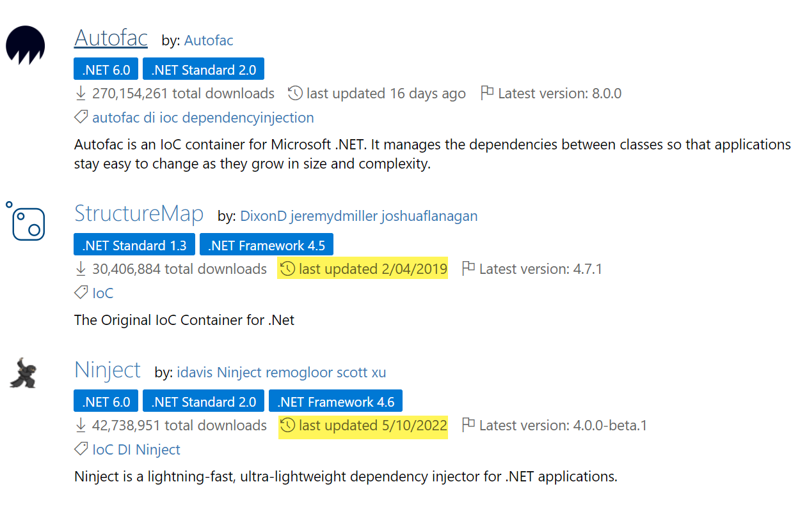

IoC containers are powerful tools that implement the IoC principle and automate the process of dependency resolution and object instantiation. They serve as central repositories of services and manage the lifecycle of objects. Some popular IoC containers in the .NET ecosystem include StructureMap, Autofac, Castle Winsdor, Ninject, Unity. At SSW we recommend using [.NET built-in Dependency Injection](https://learn.microsoft.com/en-us/dotnet/core/extensions/dependency-injection) as default. Read more on [Dependency injection in ASP.NET Core](https://learn.microsoft.com/en-us/aspnet/core/fundamentals/dependency-injection?view=aspnetcore-8.0).

However, in larger applications, manually registering dependencies can become cumbersome and easy to forget. In those cases, we recommend using [Scrutor](https://github.com/khellang/Scrutor). While it isn't a DI container itself, it works on top of the .NET built-in Dependency Injection capabilities and adds assembly scanning to automatically register discovered types.

<!--endintro-->

When selecting a Dependency Injection container it is worth considering a number of factors such as:

* Ease of use
* Configurability: Fluent API and/or XML Configuration
* Performance (Unless you have a very high traffic application the difference should be minimal)
* NuGet Support (only Ninject is doing a poor job of this) - see image

The top tools all contain comparable functionality. In practice which one you use makes little difference, especially when you consider that your container choice should not leak into your domain model.

**Important:** Unless a specific shortfall is discovered with the container your team uses, you should continue to use the same container across all of your projects, become an expert with it and invest time on building features rather than learning new container implementations.

::: bad  
  
:::

```csharp
using SSW.SugarLearning.DependencyResolver;
using StructureMap;

namespace SSW.SugarLearning.WebJob.BadgeTask
{
    public class Program
    {
        private const string ConfigKey_AppInsightInstrumentationKey = "AppInsightInstrumentationKey";

        private static void Main()
        {
            var environment = ConfigHelper.GetEnvironmentLabel();
            var notifyUserOnDisqualification = environment == EnvironmentLabel.Production;
            IContainer container = IoC.Initialize(); 
            new BadgeTaskJob(Program.ConfigKey_AppInsightInstrumentationKey, container, notifyUserOnDisqualification).Run();
        }
    }
}
```
::: bad
Bad example - Use the StructureMap IoC container but did not do the proper dependency injection
:::

```csharp
var builder = WebApplication.CreateBuilder(args);

builder.Services.AddApplication();
builder.Services.AddInfrastructure(builder.Configuration);
builder.Services.AddAutoMapper(typeof(Program));
builder.Services.AddValidatorsFromAssemblyContaining(typeof(SSW.SugarLearning.Application.DependencyInjection));
builder.Services.AddApplicationInsightsTelemetry();
builder.Services.AddSingleton<ITelemetryInitializer, AppInsightsTelemetryInitializer>();
builder.Services.AddSingleton<AssetDomain>();

var app = builder.Build();
app.Run();
```
::: good
Good example - Use ASP.Net Core built-in Dependency Injection for web app
:::

```csharp
var builder = Host.CreateApplicationBuilder(args);
IHostEnvironment env = builder.Environment;

builder.Configuration
.AddJsonFile("appsettings.json", optional: true, reloadOnChange: true)
.AddJsonFile($"appsettings.{env.EnvironmentName}.json", true, true);    

builder.Services.AddInfrastructure(builder.Configuration);
builder.Services.AddScoped<BadgeTaskJob>();

using IHost host = builder.Build();
using var scope = host.Services.CreateScope();
scope.ServiceProvider.GetRequiredService<BadgeTaskJob>().Run();
```
::: good
Good example - Use .NET built-in Dependency Injection for console app
:::


