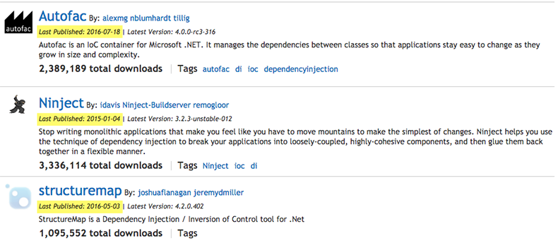
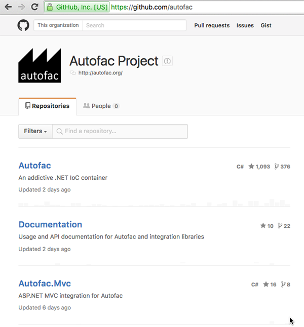

You can waste days evaluating IOC containers. The top ones are quite similar. There is not much in this, but the best ones are StructureMap and AutoFac. At SSW we use Autofac on most projects.

Other excellent DI containers are Ninject and Castle Winsdor. They have weaknesses, some are listed below.

<!--endintro-->

Dependency Injection is an essential ingredient to having maintainable solutions. IOC containers make doing dependency injection easier.

When selecting a Dependency Injection container it is worth considering a number of factors such as:

* Ease of use
* Configurability: Fluent API and/or XML Configuration
* Performance (Unless you have a very high traffic application the difference should be minimal)
* NuGet Support (only Ninject is doing a poor job of this) - see image

The top tools all contain comparable functionality. In practice which one you use makes little difference, especially when you consider that your container choice should not leak into your domain model.

**Important:** Unless a specific shortfall is discovered with the container your team uses, you should continue to use the same container across all of your projects, become an expert with it and invest time on building features rather than learning new container implementations.

::: bad  
  
:::

::: good  
  
:::

**Note:** Autofac's support for child lifetime containers may be  significant for some: 
[http://nblumhardt.com/2011/01/an-autofac-lifetime-primer](http://nblumhardt.com/2011/01/an-autofac-lifetime-primer/)

StructureMap does also support a kind of child container

::: good
Figure: Good Example - the web / mvc integration package layer for Autofac is developed by the same core Autofac team. Some containers (such as Structure Map) require third-party integration layers   

:::

### Further Reading:

* [Do you use a dependency injection centric architecture?](/do-you-use-a-dependency-injection-centric-architecture)
* [Do you generate the VS dependency graph?](/do-you-generate-the-vs-dependency-graph)
* [Do you know what to do about ASP.NET Core default dependency injection?](/do-you-know-what-to-do-about-asp-net-core-aka-asp-net-5-default-dependency-injection)
