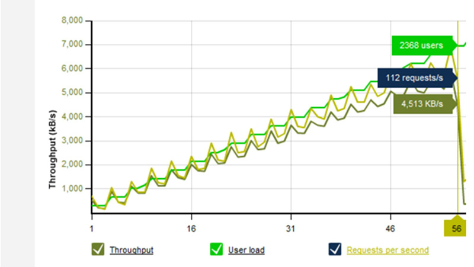

Load testing places a simulated "load" or demand on your web application and measures how it responds to that load, recording such valuable metrics as:

* Throughput rates
* Resource and environment utilization (e.g. CPU, physical memory, etc.)
* Error rates
* Load balancer performance

Load testing tools are designed to help you perform load testing, by recording metrics about the application as the load is varied and allowing you to visualize where user load impacts performance and/or causes application errors.

<!--endintro-->

## Choosing a load testing tool

There are a number of factors to take into account when choosing a tool to help you with load testing, including:

* The number of users you want to simulate
* The infrastructure you have available
* The cost model

### Number of users and infrastructure choices

Most commercial load testing tools will support some number of virtual users when running the tests on your hardware. For more significant, real-world loads, however, cloud-based offerings provide the opportunity for almost unlimited scale.

For small user loads, utilizing your own hardware may be sufficient. For larger loads, the tests will likely need to be run on some type of cloud infrastructure (either provided by the tool vendor or your own preferred service, e.g. Microsoft Azure). The ability to scale load tests on demand via cloud resources has made large-scale load testing much more feasible for modern applications.

### Cost model
open source vs. commercial and why

**From here**

## Some of the best load testing tools
**refresh this list**

* [Loader.io](https://loader.io/)
* [Loadstorm.com](https://loadstorm.com/)
* [LoadView-testing.com](https://www.loadview-testing.com/)
* [LoadImpact.com](https://loadimpact.com/)
* [jmeter.apache.org](http://jmeter.apache.org/)

**shout out Azure Load Testing** and note it uses JMeter to do the grunt work
https://docs.microsoft.com/en-us/azure/load-testing/overview-what-is-azure-load-testing

get a good screenshot or two from one or more tools

**told old, replace**

