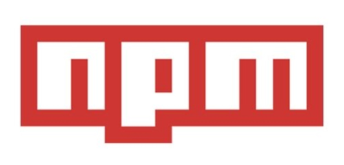
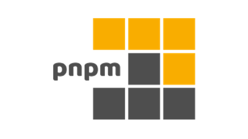

When it comes to package management in JavaScript, 3 major players dominate the scene. Have you considered which one offers the best synergy with your development goals?

<!--endintro-->

While all three package managers have their strengths, the choice often boils down to the specific needs of a project and the preferences of the development team. Yarn offers a balanced blend of speed and reliability, npm provides familiarity and wide adoption, and pnpm shines in terms of efficiency and space-saving.

## 1. [npm](https://www.npmjs.com/)

Overview: npm has long been the backbone of JavaScript development. It is the default package manager for the Node.js JavaScript runtime environment and has been widely adopted by the developer community.

::: info 
**Notable Incident:** In 2016, the removal of the "left-pad" package from npm caused widespread issues, making developers reconsider their reliance on the platform.
:::

**Strengths:**

- **Mature & Widely Adopted**: npm has a long history and vast package repository.
- **Integrated with Node.js**: Being the default for Node.js makes it straightforward for many developers.

## 2. [Yarn](https://yarnpkg.com/) (Recommended)

Overview: Introduced by Facebook, Yarn was developed as an alternative to npm, addressing some of the issues developers faced with npm.

**Strengths:**

- **Speed**: Yarn is known for its faster package installation times compared to npm.
- **Offline Support**: Once you've installed a package with Yarn, it can be reinstalled without an internet connection, preventing potential disruptions like the "left-pad" incident.
- **Deterministic Installs**: Yarn generates a lock file to ensure consistent installations across different systems.

## 3. [pnpm](https://pnpm.io/) (Recommended)

Overview: pnpm is a newer entrant in the package manager arena, but it brings unique features to the table.

**Strengths:**

- **Efficiency**: pnpm's installation speed is even faster than Yarn's and npm's due to its unique approach of linking packages from a global cache.
- **Disk Space Savings**: By linking to a global cache, pnpm ensures packages aren't redundantly stored across multiple projects.
- **Strict Package Isolation**: pnpm ensures that projects get exactly what they need and no additional, potentially conflicting packages.
