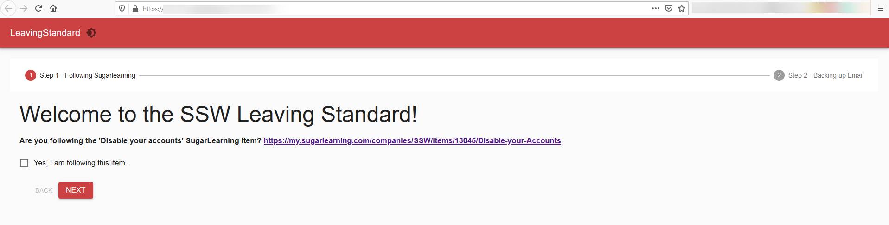
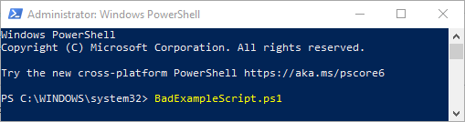

PowerShell Universal is a platform to make websites, dashboards, and scripts using only PowerShell commands, without the need to have any web development knowledge, perfect for your SysAdmins.

[PowerShell Universal](https://ironmansoftware.com/powershell-universal/) is a platform built by Ironman Software that allows you to:

1. Create webpages and dashboards with PowerShell commands;
2. Orchestrate PowerShell script execution, together with auditing;
3. Use its API to communicate with the scripts and dashboards.

<!--endintro-->

For example, SSW uses PowerShell Universal Dashboards to automate repeating SysAdmin tasks and create a nice user interface to run them:

::: good  
  
:::

Running commands directly in the PowerShell CLI without data, schedule or a nice UI is a thing of the past, and you should be using the capabilities of PowerShell Universal to keep your scripts well maintained.

::: bad  
  
:::

You can read its full documentation at [https://docs.ironmansoftware.com](https://docs.ironmansoftware.com/).
