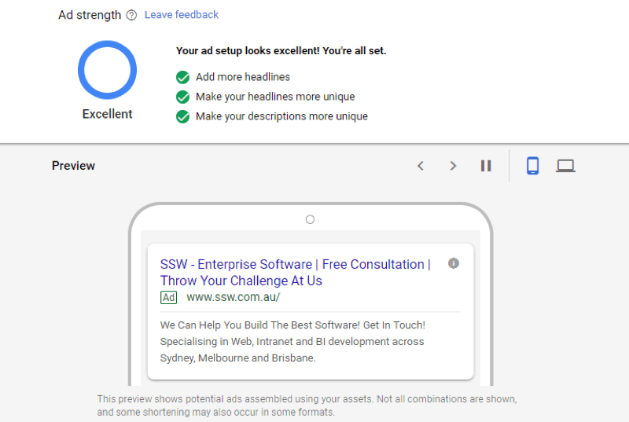

Do you know what the best practices are for Google Ads?

Here are the below are the best practices you should know:

* Ensure time zone and currency are set up correctly!
* Define target location – choose a city, a region or a country according to your demographics
* Set a budget for each campaign based on needs
* Connect your account to Google Analytics. It’s important to check your customer activity (which is essential for remarketing actions!)
* Take advantage of conversion tracking
* Use ALL ad extensions available!
* Match type ad group strategy – Use similar & segmented keywords! Build small, tightly focused ad groups with a few (5-10) keywords
* Take advantage of audiences and exclusions choosing whoever is or not your right audience
* Make sure you use enough headlines and good descriptions to improve the strengthens of your ad
* It's also a good idea to make an A/B test ad copy (split testing)
* Focus on click and impressions with CPC bidding
* Use high-quality optimised landing pages – make sure your website is mobile friendly. Test your URL with this Google tool!
* Test your ads at least every fortnight, if possible one day a week. Use the tool Ad Preview and Diagnosis Tool and try different keywords and locations, depending on your business.
* Review the Search Terms Report

<!--endintro-->

  

### Additional resources

Whilst this overview of Google Ads will provide you with enough detail to get a campaign started, there may be additional questions you need answered or information, and that's where these resources come in:

* [Google Ads Help](https://support.google.com/google-ads/?hl=en#topic=10286612) – Google have created a help centre for all your Google Ads related questions, here you can search for questions, or submit questions to forums for help. This should be your first port of call for any issues!
* [WordStream](https://www.wordstream.com/how-to-use-google-adwords) – This WordStream article provides a basic overview of how to use Google Ads and features a handy helpful infographic. Word Stream have other articles on Google Ads which may be useful.
* [HubSpot](https://blog.hubspot.com/marketing/google-adwords-ppc) – This free HubSpot eBook discusses all the ins and outs of PPC campaigns and is a great starting point to learn more about Google Ads. Like WordStream, HubSpot also have other helpful articles discussing Google Ads.
* [Neil Patel](https://neilpatel.com/what-is-google-adwords/) – Neil Patel is a popular digital marketer, with a strong focus on helping businesses grow. This post focuses on Google Ads and takes you through the process step by step, so it's a great starting point for some more information.
