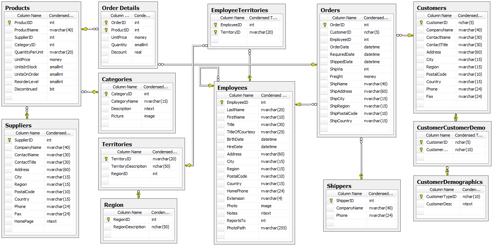

Before starting a software project and evaluating a new technology, it is important to know what the best practices are. The easiest way to get up and running is by looking at a sample application. Below is a list of sample applications that we’ve curated and given our seal of approval.

<!--endintro-->

### Northwind Schema

### SQL Server

* **[AdventureWorks](https://github.com/Microsoft/sql-server-samples/releases/tag/adventureworks)**
* **[Northwind (old SQL standards)](https://github.com/Microsoft/sql-server-samples/tree/master/samples/databases/northwind-pubs)**

### SQL Server and Azure SQL Database

* **[WideWorldImporters Sample Database](https://github.com/Microsoft/sql-server-samples/tree/master/samples/databases/wide-world-importers)**

### .NET Core

* **[SSW Clean Architecture Solution Template](https://github.com/SSWConsulting/SSW.CleanArchitecture)**
  An example REST API build with .NET 7 following the principles of Clean Architecture.
* **[SSW Northwind Traders](https://github.com/SSWConsulting/Northwind365)**
  A reference application built using Clean Architecture, Angular 8, EF Core 7, ASP.NET Core 7, Duende Identity Server 6.
* **[eShopOnWeb](https://github.com/dotnet-architecture/eShopOnWeb)**
  Sample ASP.NET Core 6.0 reference application, powered by Microsoft, demonstrating a layered application architecture with monolithic deployment model. Download the eBook PDF from docs folder. 
* **[eShopOnContainers](https://github.com/dotnet-architecture/eShopOnContainers)**
  Cross-platform .NET sample microservices and container based application that runs on Linux Windows and macOS. Powered by .NET 7, Docker Containers and Azure Kubernetes Services. Supports Visual Studio, VS for Mac and CLI based environments with Docker CLI, dotnet CLI, VS Code or any other code editor. 
* **[ContosoUniversity](https://github.com/jbogard/ContosoUniversityDotNetCore-Pages)**
  This application takes the traditional Contoso University sample applications (of which there have been many), and try to adapt it to how our "normal" ASP.NET applications are built.

### Blazor

* **[Awesome Blazor Browser](https://github.com/jsakamoto/awesome-blazor-browser)**
  A Blazor example app that links to many other useful Blazor examples
* **[Blazor Workshop](https://github.com/dotnet-presentations/blazor-workshop/)**
  A Blazor workshop showing how to build fast food website

### UI - Angular

* **[Tour of Heroes](https://angular.io/tutorial/tour-of-heroes)** 
  Default Angular sample app as part of the documentation
* **[ngrx Example App](https://github.com/ngrx/platform/tree/master/projects/ngrx.io)** 
  Example application utilizing @ngrx libraries, showcasing common patterns and best practices

### UI - React

* **[Intro to React (Tic-tac-toe)](https://react.dev/learn/tutorial-tic-tac-toe)**  
  Introductory React tutorial that builds a simple Tic-tac-toe game
* **[Intro to Redux (Counter example)](https://redux.js.org/tutorials/essentials/part-2-app-structure#the-counter-example-app)**  
  Introductory React Redux tutorial that builds a simple counter app