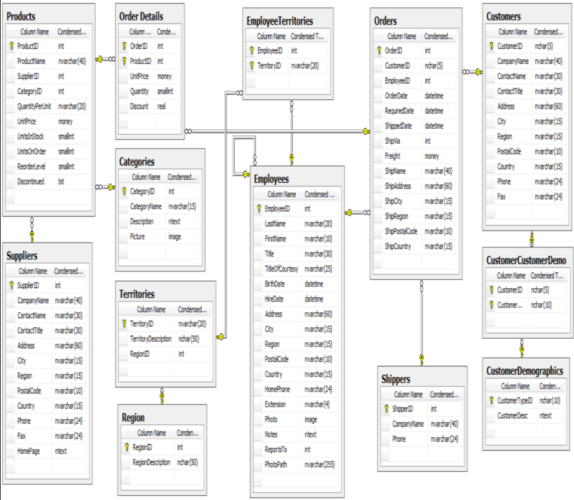

Before starting a software project and evaluating a new technology, it is important to know what the best practices are. The easiest way to get up and running is by looking at a sample application. Below is a list of sample applications that we’ve curated and given our seal of approval.

<!--endintro-->

### Northwind Schema

### SQL Server

* **AdventureWorks** – 
      <https://github.com/Microsoft/sql-server-samples/releases/tag/adventureworks>
* **Northwind** - <https://github.com/Microsoft/sql-server-samples/tree/master/samples/databases/northwind-pubs>

### SQL Server and Azure SQL Database

* **WideWorldImporters Sample Database** - <https://github.com/Microsoft/sql-server-samples/tree/master/samples/databases/wide-world-importers>

### ASP.NET MVC + WebAPI

* **MVC Music Store** - 
      <http://mvcmusicstore.codeplex.com/>  
A nice simple sample of ASP.NET MVC with Entity Framework

* **MyCompany Demo** - 
        <http://aka.ms/mycompanyapps>    
  More complicated sample showing off a lot of technologies as well as mobile platform
  
* **Enterprise MVC Music Store** - 
        <https://github.com/SSWConsulting/enterprise-musicstore-mvc4> & 
        <https://github.com/SSWConsulting/enterprise-musicstore-api-aspnet> 
  Music store sample with enterprise architecture using Entity Framework and the [Onion Architecture](/do-you-know-the-layers-of-the-onion-architecture)
  
* **Clean Architecture Solution Template** - <https://github.com/jasontaylordev/CleanArchitecture>    
  An Example SPA built with Angular and ASP.NET Core following the principles of Clean Architecture
  
### Blazor

* **Awesome Blazor Browser** - <https://github.com/jsakamoto/awesome-blazor-browser>   
  A Blazor example app that links to many other useful Blazor examples

### UI - Angular

* **Tour of Heroes**  - <https://angular.io/tutorial/> 
  Default Angular sample app as part of the documentation
* **Angular Music Store**  - <https://github.com/SSWConsulting/enterprise-musicstore-ui-angular2>  & <https://github.com/SSWConsulting/enterprise-musicstore-api-aspnet> 
  WebAPI backend with an Angular frontend
* **ngrx Example App**  -  <https://github.com/ngrx/platform/tree/master/projects/example-app>
  Example application utilizing @ngrx libraries, showcasing common patterns and best practices
  
### UI - React

* **Intro to React (Tic-tac-toe)**  - <https://reactjs.org/tutorial/tutorial.html> 
  Introductory React tutorial that builds a simple Tic-tac-toe game
