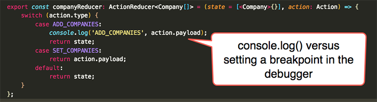
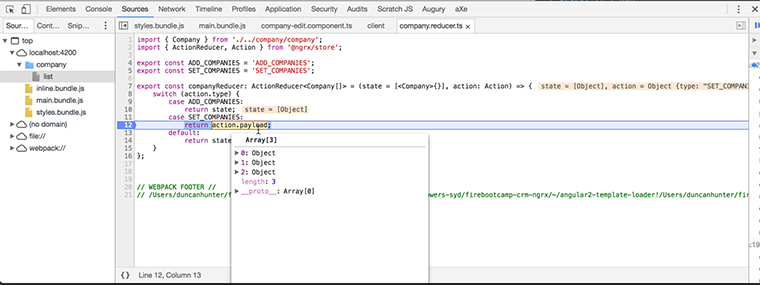
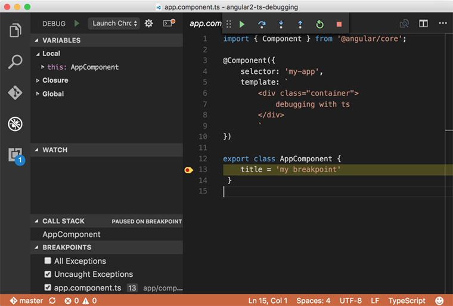
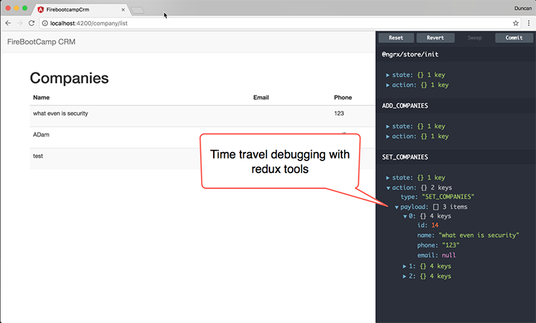

Debugging JavaScript application can be difficult. Having to console.log results can make for a slow and cumbersome development experience. There are five ways you can debug a JavaScript application without leaning on console.log() as your main tool.

<!--endintro-->

### Options for Debugging JavaScript applications

**1. Debug your JavaScript using console.log()**  
While this is a valid approach it should only be utilized for the simplest of manual debugging tests as they are slow, you have to re-run the app every time, do not allow you to change state mid-flight and developers sometimes forget to clean up after themselves and the code becomes riddled with console.log statements.

::: bad  
  
:::

**2. Debug in the browser with a breakpoint**  
Chrome is by far the most popular browser for the average web developer followed by Firefox, but all the major browsers have a debugging tool.

**3. Debug in an IDE**  
It is often more effort than it is worth to debug JavaScript in your IDE and it is still not very popular. If your app is a server-s ide NodeJS JavaScript app then it is very different since this type of JavaScript app does not run in the browser and this is what the IDE is designed for.

- [Visual Studio Code Chrome Debugger](https://github.com/Microsoft/vscode-chrome-debug) - Painful to set up source maps for advanced JavaScript applications that run in memory dev servers like WebPack Dev Server.
- Visual Studio 2015 - Only works with TypeScript in Internet Explorer

**4. Time Travel Debugging with Redux**  
Using tools like [ngrx's store dev tools](https://github.com/ngrx/store-devtools). You can traverse back and forth between states with excellent UI tools. Debugging through your states is much better than just debugging the current state but also to be able to see the actions triggered to change state.

**5. Hot Module Reloading**  
The problem with the above approaches is every time you make a change to your code you need to reload the website and navigate back to the page and state of that page again and again to repeat your manual test. Hot Module Replacement (HMR) exchanges, adds or removes modules while an application is running without a page reload.

- [WebPack Hot Module Reloader](https://webpack.js.org/)

