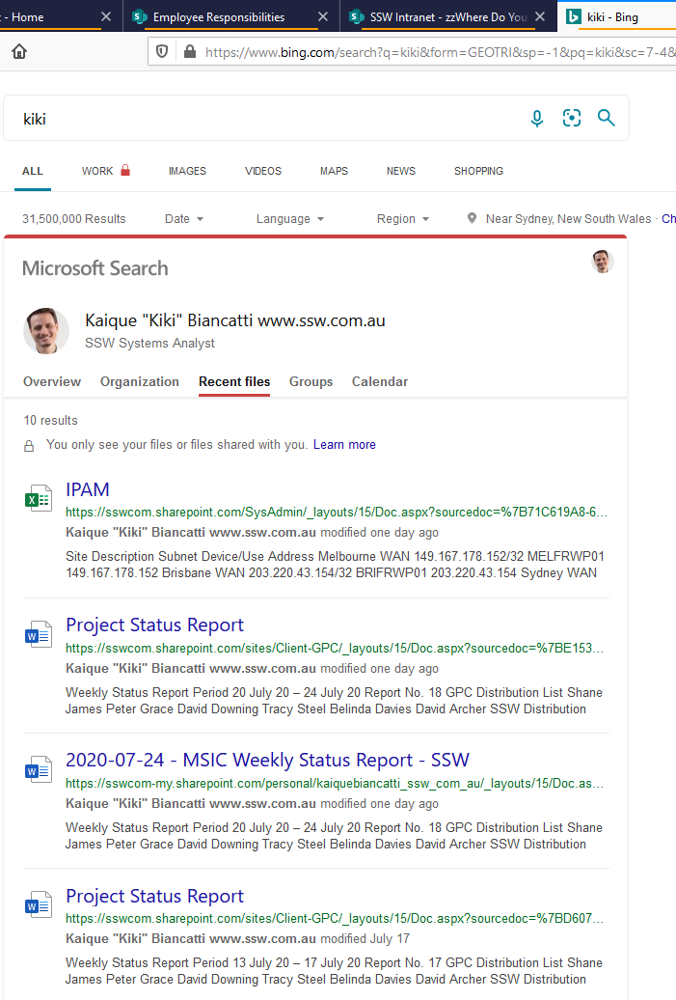

In Bing, if you are logged in to your work account, you can easily see your recent files!

The same works for your work colleagues.

<!--endintro-->

  

::: info
**Suggestion to Microsoft:** Put a checkbox "Show thumbnails" to allow a better experience.
:::

In a slower way, you can go to **M365 Copilot | Search | Content** to see this information with a different UI with big images.

