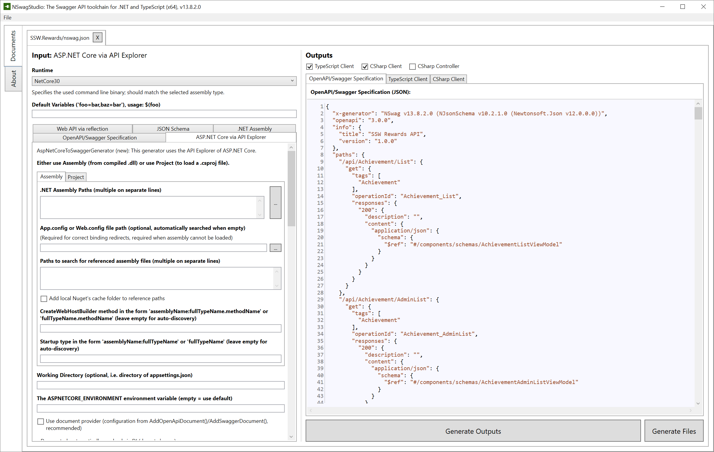
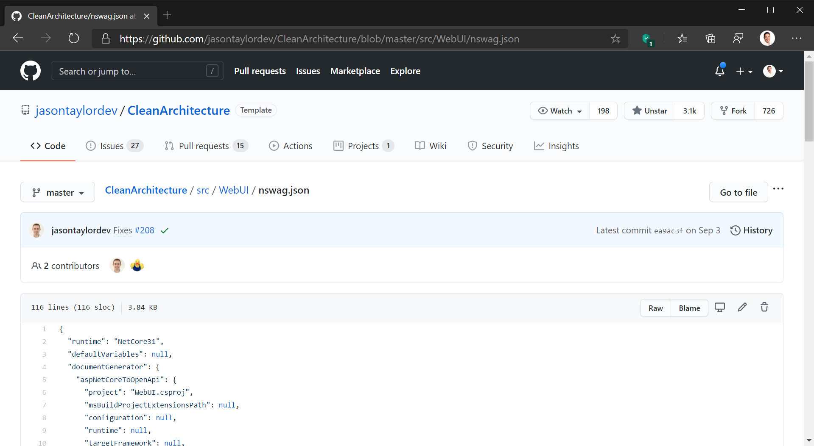

​You can save time and reduce human error by automatically generating clients for your APIs.​ 

 <excerpt class='endintro'></excerpt> 

The best tool for this is <a href="https://github.com/RicoSuter/NSwag">NSwag</a>. 

This is Microsoft's recommended approach, and you can read more about how to set this up in your ASP.Net Core project at <a href="https://docs.microsoft.com/en-us/aspnet/core/tutorials/getting-started-with-nswag?view=aspnetcore-3.1&tabs=visual-studio">the official documentation</a>.​ 

If you use the Clean Architecture template developed by SSW's @JasonTaylorDev, this is built in out of the box. See our <a href=/clean-architecture-the-best-way-to-get-started>rule on getting started with clean architecture</a>. 
<dl class="goodImage"><dt></dt><dd>​​​Figure: Good Example - NSwag Studio lets you customise your nswag config</dd></dl><dl class="goodImage"><dt></dt><dd>Fig​​ure: Good Example - @JasonTaylorDev's Clean Architecture templace comes with this built in </dd></dl>

