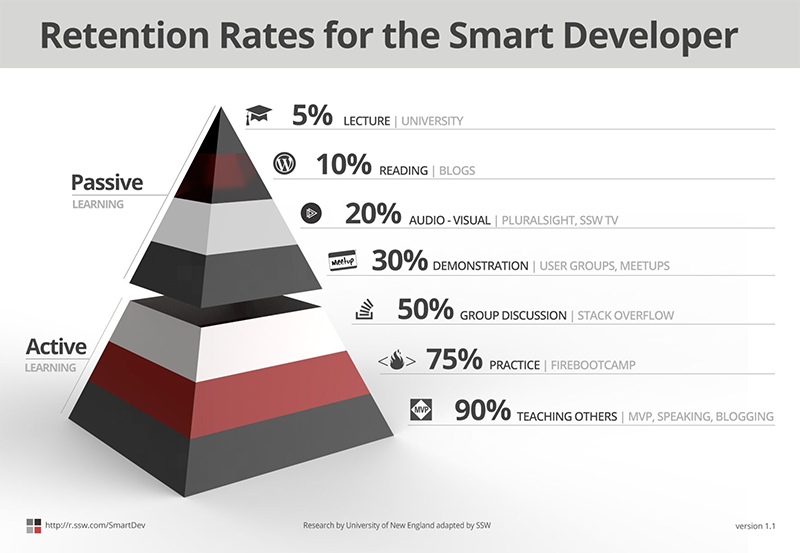

Learning a new technology is something a developer has to do at least every few years. The industry landscape is constantly changing and to keep up and the developer has to really master the art of learning.

Over the years, SSW has trained thousands of developers and we have found that the best way to learn is through mentorship. [Mentorship](http://adamcogan.com/2016/06/06/train-devs-quickly/) is when an experienced developer teaches and codes with their mentee. By working closely together on a regular basis they are able to impart their knowledge and experience into the mentee.

Of course, there are other ways of learning and the chart below discusses the effectiveness of each.

<!--endintro-->

### Related link

* [I have learnt how to train developers in the shortest time possible](http://adamcogan.com/2016/06/06/train-devs-quickly/ "I have learnt how to train developers in the shortest time possible")
