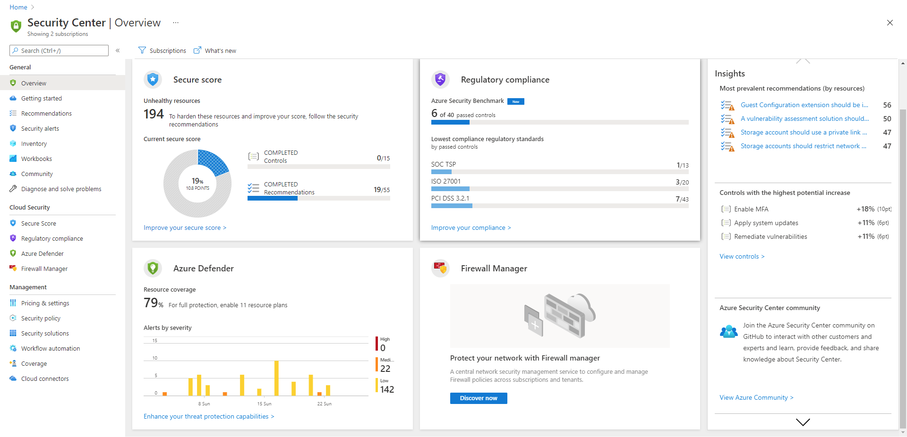
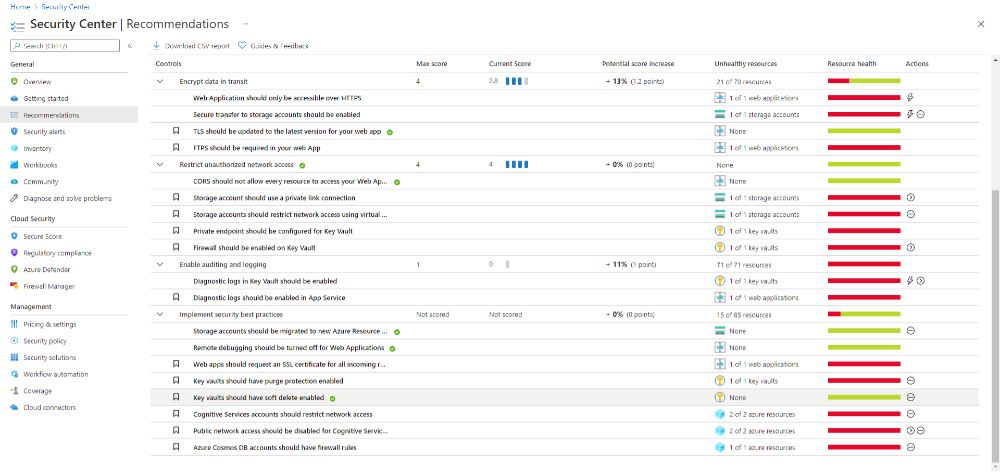
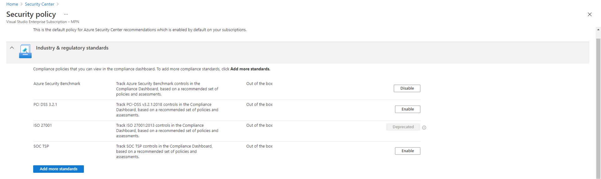

<!--endintro-->

Azure Security Center is a fantastic way to start improving the security of your Azure environment. To be able to see any of the information Azure Security Center can provide, you'll need to follow [Azure Security Center permissions guidelines](https://docs.microsoft.com/en-us/azure/security-center/security-center-permissions).

The Secure Score provides a way to easily identify which things are of greater importance and to help work methodically to improve security. 

A lot of the recommendations are very simple to rectify, often it takes very little effort to make significant improvements.

**Note:** Remember though, that only you as the application developer can know how sensitive the data you are handling is.

If you are working with a system that must comply with a regulatory framework around data protection, Azure Security Center allows turning on security policies covering many of the most common regulatory frameworks. PCI DSS 3.2.1, ISO 27001 and SOC TSP are all available, and there's a long list of others.

