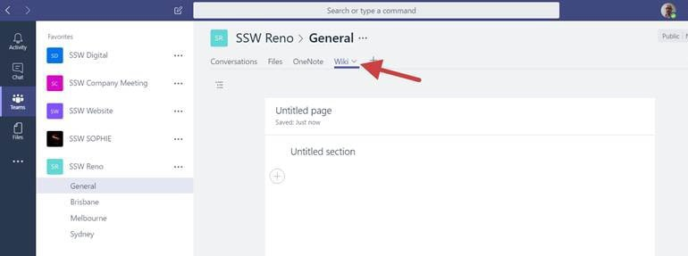

​​You should use OneNote instead of the default Wiki. This way you can use it offline on your mobile apps.  
 <excerpt class='endintro'></excerpt> 
<dl class="badImage"><dt>​​</dt><dd>Bad Example: Default tab – Wiki. There is no offline mobile application</dd></dl><dl class="goodImage"><dt> 
       
   </dt><dd>Good Example: Use OneNote. Now you can use the normal OneNote Desktop and Mobile app for iOS and Android (including offline support) ​ </dd></dl>

   <strong>​Note:</strong> Rename the tab to show that it is a OneNote Tab. E.g.:​ "<strong>OneNote - SSW Reno Sydney</strong>"​​ 

