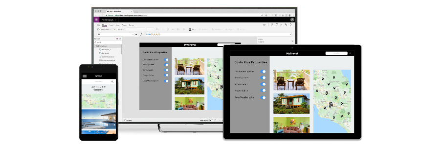
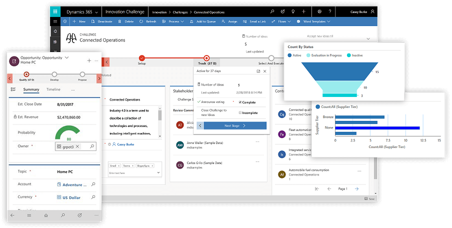

Power Apps provide makers a highly productive low code environment, but before you jump into building your first Power App it's important to know the difference between Canvas and Model-Driven Apps and to make the right choice upfront. 

<!--endintro-->

### Canvas Apps

Canvas Apps are just that, a blank canvas (or a template) that controls can be placed on in any order, style, and format that is required. Over 300 data sources are supported, and there is a very low cost of entry in terms of programming knowledge required. An Office “power user" or as they are now called “citizen developer" makers will have no problem developing a Canvas App that is very powerful. Here are some examples:

* Need an App to search your corporate directory for staff located within a particular radius of head office, not a problem a Canvas App can do that
* Need an App to create a checklist of work performed, take a photo of a finished product, then upload to cloud storage, not a problem a Canvas App can do that

### Model-Driven Apps

Model-Driven Apps are data (or schema) first approach, you model your data, that data is stored in the Dataverse, formerly known as CDS (Common Data Service). The Dataverse has the concept of an entity, entities contain fields, views, forms, relationships, processes etc. Model-Driven Apps are much more rigid in their design approach than Canvas Apps. The UI elements slot into Tabs, Sections, and the form controls are limited when compared to a Canvas App (but can be expanded on if required).

The entry-level for a Model-Driven App maker is also higher with Data Modelling, JavaScript, C# knowledge being desirable if not a minimum. Would someone who didn't have these skills be able to develop a Model-Driven App? Yes, absolutely, but they wouldn't have an as productive experience as they would with making a Canvas App.

Model-Driven Apps can also host Canvas Apps, where the majority of the application logic, forms, workflows can be in the main Model Driven App, and where a specific piece of functionality is required, a Canvas App can be embedded into a Model-Driven App form. An example of this could be taking photos of a finished job and uploading it to OneDrive.

### OK, I get it, now which do I use?

**Canvas Apps** are ideal for task-based apps, an example might be logging support tickets, a task checklist, submitting an expense claim, etc.

**Model-Driven Apps** are more suited to larger solutions, an example of this could be where a customer submits a support request, and based on the ticket type,  the request is assigned to the correct team, once the team actions this request the customer receives a survey email to rate the service given.

With a Model-Driven App, a complete end to end solution can be developed.