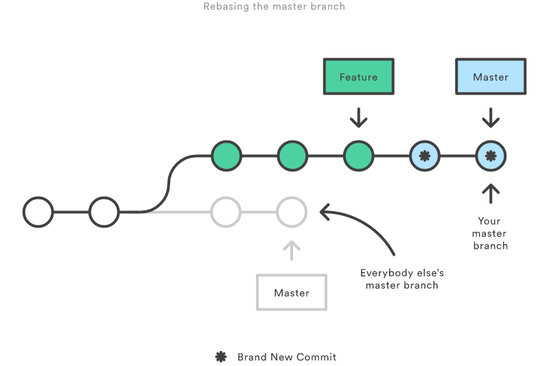

​Rebasing is great for ensuring a clean project history... but it can be dangerous in inexperienced hands.

 <excerpt class='endintro'></excerpt> 

 
   <strong>The golden rule of git rebase is to never use it on public branches. </strong>(ie. never rebase master).

You should never rebase master onto a feature branch. This would move all of the commits in master onto the tip of  the feature branch (not the other way around). 

Since rebasing results in brand new commits, Git will think that your master branch’s history has diverged from everybody else’s. If you were to Push this to the server... <a href="https://www.atlassian.com/git/tutorials/merging-vs-rebasing/the-golden-rule-of-rebasing">expect lots of pain to fix it up</a>!
<dl class="badImage"><dt>  </dt><dd>Figure: Bad Example: Rebasing master onto a feature branch can cause project history to become confused.    </dd></dl><dl class="image"><dt> ​ </dt><dd>Figure: To get it wrong in Visual Studio you would need to change the current branch to master and then choose rebase. While this is possible, the VS team have done a good job making it hard to do the wrong thing</dd></dl><dl class="goodImage"><dt>  </dt><dd>Figure: Good Example - Rebase your Feature branch onto Master</dd></dl>

