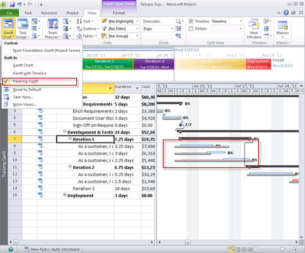

Projects will change and deviate from the original scope – that is a given in software development. When a client sends you an urgent task (as per the [order of importance rule](/do-you-complete-work-in-order-of-importance-aka-priorities)) then you need to do it in the current sprint.

This should rarely happen, as new features should be pushed back to the backlog, to be prioritised into the next sprint, but sometimes the Product Owner will say that it's urgent and has to be done immediately.

<!--endintro-->

Understanding the impact of slotting in a new request into the sprint is important because you can tell the Product Owner:

> "If we do X now that means we can’t do Y and Z in this sprint and they will be push back to the backlog".

**Tip:** If you're using Project Server, you can see the impact on the timeline visually in the "Tracking Gantt". 

