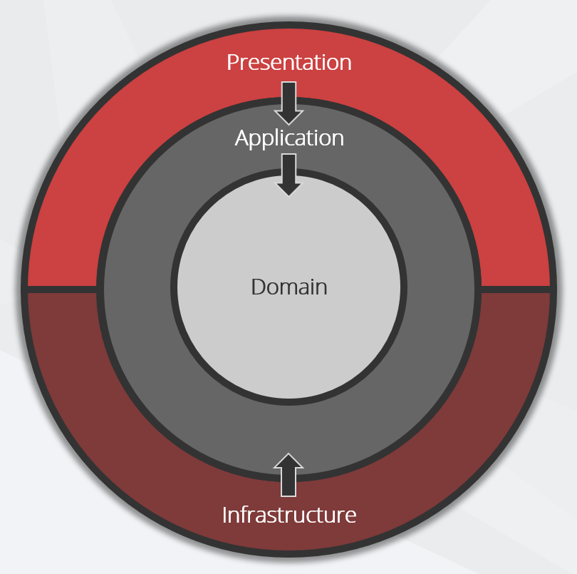

Clean Architecture is, at its core, about creating a Separation of Concerns, and building it in such a way that it becomes hard to violate this core principle. The outcome of this is to guide teams over time towards the [pit of success](https://ricomariani.medium.com/the-pit-of-success-cfefc6cb64c8).

This approach enables the development team to build a system in the same way that follows best practices, without the need for micromanagement. Having Clean Architecture enables changes to have isolated impact, and allows for the system to be easily extended and maintained.

This is the difference between a system that lasts 2 years, and a system that lasts 20 years.

<!--endintro-->

Instead of having Core (Domain & Application layers) depend on data access and other infrastructure concerns, we invert these dependencies, therefore Infrastructure and Presentation depend on Core. This is achieved by adding abstractions, such as interfaces or abstract base classes, to the Application layer. Layers outside of Core, such as Infrastructure and Persistence, then implement these abstractions.

There are 4 layers to Clean Architecture, and each layer has a specific purpose. The 4 layers are:

## Layers

### Domain

The Domain layer contains the enterprise logic and types. This layer should not depend on anything outside of itself. This layer typically defines the models and data structures that represent the business entities and concepts.

Examples:

 - Entities
 - [Value Objects](https://learn.microsoft.com/en-us/dotnet/architecture/microservices/microservice-ddd-cqrs-patterns/implement-value-objects) (immutable objects that represent a single value or concept)
 - [Domain Events](https://learn.microsoft.com/en-us/dotnet/architecture/microservices/microservice-ddd-cqrs-patterns/domain-events-design-implementation) (something that has happened in the past)

### Application

The Application layer contains the business logic and types. This layer is dependent on the Domain layer, but not on anything outside of itself. This layer typically defines the application services that implement the use cases of the system. These services orchestrate the flow of data using the domain entities and types.

The Application layer only depends on abstractions, defined in interfaces, and these interfaces are implemented in outer layers. For example, persistence concerns (such as saving an item to a database) are defined only in terms of requirements; the persistence logic in the Infrastructure layer implements these requirements.

As the Presentation layer is external to Core, the Application layer has no dependency on any presentation concerns.

One example is obtaining information about the HTTP interaction (e.g. the user's ID or other information from an access token). This data is in the HttpContext, which is exposed in the Presentation layer, but not the Application layer. Rather than add a dependency on the Presentation layer, the Application layer can define its abstract requirements in an interface which can be implemented in the Presentation layer.

Examples:

  - Application Services
  - Use Cases/Features
  - DTOs

### Infrastructure

The Infrastructure layer is where the external systems are interacted with. For example, you might setup a library to wrap a third party Web API, database, or identity provider. This layer is dependent on the Application Core. This layer defines the implementation of the abstractions defined in the Application layer.

This layer is important for keeping our application clean and testable. For general unit testing this layer is the one that is mocked out the most - therefore interfaces should make sense and be easy to mock.

Examples:

  - Persistence
  - Wrappers for interacting with External APIs
  - Email/SMS
  - Logging
  - Authentication Provider

### Presentation

The Presentation layer is where the system is interacted with. This might be via a Web API, a GUI, or a CLI.

This layer is dependent on the Application layer & the Infrastructure layer.

The Presentation layer's sole responsibility is to interface with the means of external interaction and the Application Core. This layer should not contain any business logic, and should not be dependent on any external items.

The most common use case is a Web API - and it's implementation should define the API routes, its input & output models, using HTTP or other web protocols. The API should then call the Application layer, and either return an Application DTO or map to a Presentation ViewModel if required.

## Principles

To achieve the this layering and separation of concerns, we need to follow some principles.

To allow for the separation of concerns, we need to follow the Dependency Inversion Principle (DIP). This principle states that high-level modules should not depend on low-level modules. Both should depend on abstractions. Abstractions should not depend on details. Details should depend on abstractions.

What this means is that the Application Core should not depend on anything outside of itself - and we use interfaces in the Application or Infrastructure layer to achieve this.

Bad Example: Application Depends on Infrastructure, for example relying on a concrete implementation, instead of allowing an interface.
Good Example: Repository Pattern, where the Application layer depends on an interface, and the Infrastructure layer implements the interface.

With this design, all dependencies must flow inwards. Core has no dependencies on any outside layers. Infrastructure, Persistence, and Presentation depend on Core, but not on one another.

## Benefits

This results in an architecture and design that is:

* **Independent of Frameworks** - *Core should not be dependent on external frameworks such as Entity Framework*
* **Testable** -  *The logic within Core can be tested independently of anything external, such as UI, databases, servers. Without external dependencies, the tests are very simple to write.*
* **Independent of UI** - *It is easy to swap out the Web UI for a Console UI, or Angular for Vue. Logic is contained within Core, so changing the UI will not impact logic.*
* **Independent of Database** -  *Initially you might choose SQL Server or Oracle, but soon we will all be switching to Cosmos DB*
* **Independent of any external agency** -  *Core simply doesn't know anything about the outside world*

While the design in the above figure only includes three circles, you may need more - just think of this as a starting point.

### References

* [The Clean Architecture](http://blog.cleancoder.com/uncle-bob/2012/08/13/the-clean-architecture.html)
* [Clean architecture](https://docs.microsoft.com/en-us/dotnet/standard/modern-web-apps-azure-architecture/common-web-application-architectures#clean-architecture)
