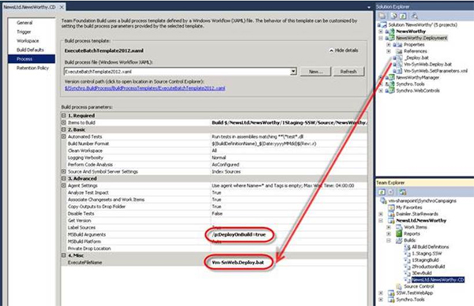

Ideally, Builds are created once, and can then be deployed to any environment, at any point in time (Build Once, Deploy Many).
We do this by including deployment batch files in the solution, and specifying them to be called in the Build Process Template.

<!--endintro-->

::: good  
  
:::

|  | ❌ Bad example - Using Builds to Deploy | ✅ Good example - Using Batch File |
|---|---|---|
| **Deployment Overview** | 1. A separate build is created per target environment   2. The MS Deploy parameters are put into the MSBuild parameters setting on the process template   3. The build for the shared development server is set to be a CI build so it is executed on every check-in | 1. One batch file per target environment is created and checked into source control alongside the web project  2. Each batch file is accompanied by a corresponding Web Deploy Parameterisation XML file with environment specific settings  3. The build process template is modified to call the batch file to continuously deploy to the shared development server |
| **Deployment Process** | 1. The build is automatically deployed to the shared dev server  2. Lots of testing occurs and we decide to deploy to staging  3. We can just kick off the staging build  4. A whole lot of testing occurs and we want to deploy to production  5. We can kick off a production build, but this will deploy the latest source code to production  6. If we want to deploy the version of the software that we have deployed to staging we have to get that specific version from source control, and then do a production build of it | 1. The build is automatically deployed to the shared dev server  2. Lots of testing occurs and we decide to deploy to staging  3. The batch file for any build can be executed and the build deployed to staging  4. A whole lot of testing occurs on staging and then we decide to deploy the same build to production   **Note:** We just call the batch file in the folder to do the deployment. No new build is required |
| **👍 Benefits** | 1. No need to create batch files or modify the process template | 1. Builds are created once, and can then be deployed many times to any environment, at any point in time (Build Once, Deploy Many)  2. When deploying to production, we use exactly the same build package as was used to deploy to staging  3. The custom build process template only does the deployment if the build succeeds and all the unit tests pass  4. Anyone with access to the batch file can deploy… including the Product Owner!  5. You only need one build per project |
| **👎 Cons** | 1. Without modifying the build process template, the build will deploy even if the unit tests fail  2. To deploy a specific build to a particular server, it is necessary to get the code from source control, and then do a build  3. Only developers can deploy 4. You need a build per environment for each project  5. Build Once, Deploy Once. (You can't redeploy a build to a different environment) | 1. You must customize the build process template to execute the specified batch file from the build folder  2. We have to create custom batch files |                                                                                                                                                                                                     
::: todo
**TODO:** AdamS - Include the steps to customize the build process template.
:::

The Web Platform Installer is great, but does not install all the Web Deploy 3.0 components required for continuous deployment.
