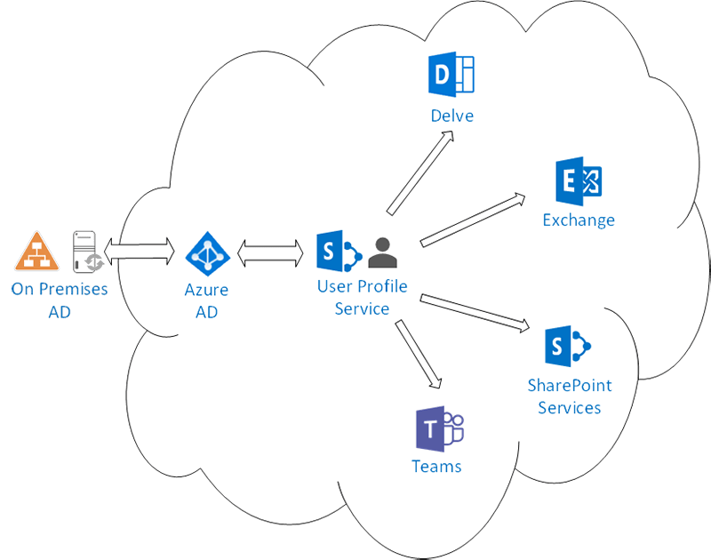
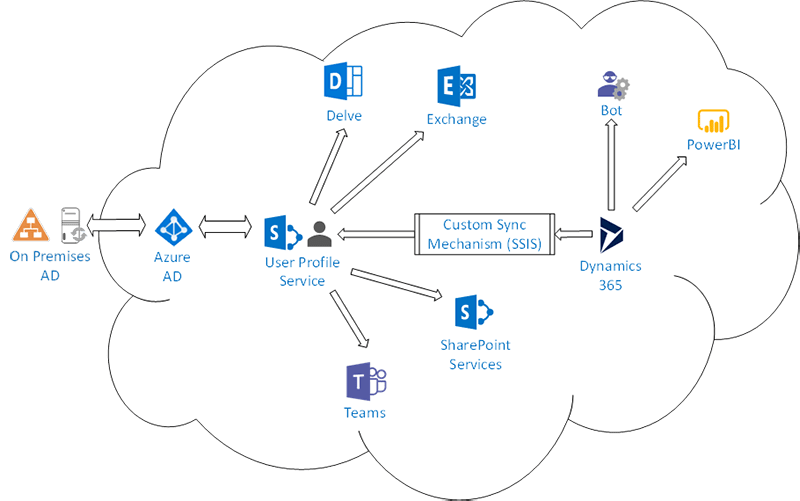

Office 365 products eg. Teams, SharePoint, Exchange use User Profile Service as their source of truth. Therefore, if you use them in your organization, the information needs to be up-to-date.

The User Profile is simply a layer of information on top of Active Directory properties. As long as Azure AD is up to date (i.e. in sync with you On-Premises AD), the information in the User Profile Service will also be. You can then add new custom properties to store information such as extra phone numbers or skills coming from a predefined list.  User Profile does not, however, allow complex custom scenarios. 

 <excerpt class='endintro'></excerpt> 
<h3 class="ssw15-rteElement-H3">Where should the source of truth be?</h3>

   <b>A: </b>Simple - If you are happy with just names and address and simple pick lists then User Profiles work great.

Office 365 User Profile Service is a good tool at managing fields related to users, but it does not offer any functionality to maintain related data such as responsibilities and projects. Therefore it cannot be used as a single source of truth if you have complex profile data. Think of all the stuff you see on LinkedIn. Maybe this will change in the future now that Microsoft owns LinkedIn. 
<dl class="image"><dt> 
       
   </dt><dd>Figure: AD, UserProfile and O365 Services interactions </dd></dl>

   <b>Tip: </b>Keep User Profiles up-to-date with 
   <a href="https://www.hyperfish.com/">hyperfish.com </a>
    
    
   <b>B: </b>Rich - If you want richer relationships eg. Many skills, many languages, past projects and roles on them etc. then you want to add an external 'Source of truth' Eg. Dynamics 365, Salesforce etc. that supports that kind of relationships. 

Companies want bots to answer more than just simple questions. If you have rich data then your bot can answer questions like "Who worked in Education and knows French". This is unfortunately not possible with AD/UserProfile custom fields and properties. In those instances, the alternative is to use Dynamics 365 (or SalesForce) as a single source of truth; and then sync back the data to simple fields in User Profile.​​ 
<dl class="image"><dt></dt><dd>Figure: CRM (Dynamics 365) used a source of truth</dd></dl>
​In this scenario, a custom sync mechanism (i.e. SSIS pipeline) will have to be implemented. Both Dynamics 365 and User Profile Service exposes APIs that can read and write properties/fields for such a system.
Then other external systems such as the public employee pages, Power BI reports and bots can query Dynamics 365 directly.  

   <b>Note:</b> you cannot use https://www.hyperfish.com (as it would be overwritten) 
    

   <b>Note: </b>Delve profile pages can only read from user profiles. Delve is a nice UI over User Profiles, but it should not be mandated to use. You will find it will not be heavily used.

Delve is more useful in companies where the “discovery” aspect is needed.

    
   TODO: [screenshot of Dynamics 365 – skills] TODO: [screenshot of Delve – skills]​ 

