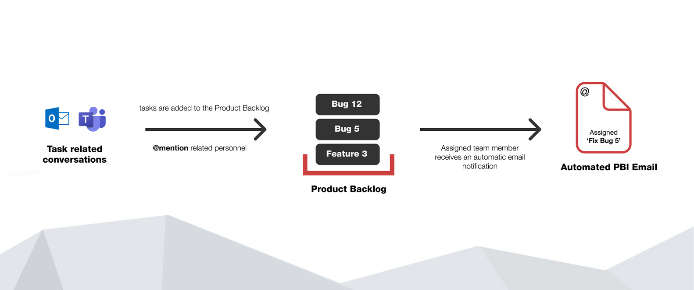
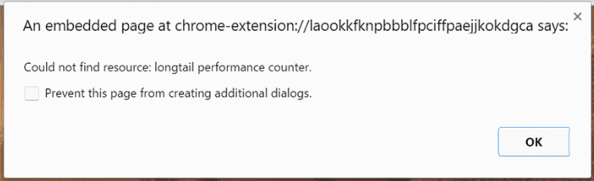
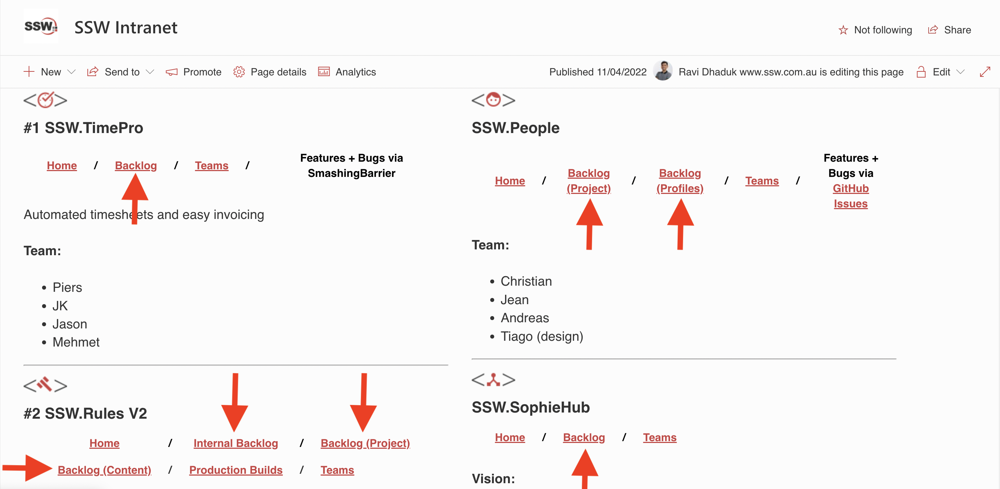

If you are unclear use IM to ask, but remember [the golden rule is to not send tasks on Teams](/important-chats-should-be-in-an-email).

It is recommended to keep track of active project backlogs on the company intranet, while also including the product owner and tech lead contact information, coupled with a link to the Teams channel of that project.

When reporting bugs and giving product feedback, it is essential that you are as descriptive as possible. This will save both you and the developer time and frustration in the long run. 

<!--endintro-->

### Tip 1: Draft your bug with enough details

Make sure you always explain and give as many details as you can of how you got an error or a bad experience. Detailed and useful descriptions can make finding the solution quicker and easier. The goal is to include enough details so the developer can focus on the development work more rather than trying to figure out what the feature requirements or bugs are. 

External source: [How to produce a good bug report](https://www.boxuk.com/insight/what-makes-a-good-bug-report/)

::: email-template  
|          |     |
| -------- | --- |
| To:      | info@ssw.com.au |
| Subject: | Your software |
::: email-content  

### Hi team,

I'm having a problem with your PerformancePro software. When I run it, it says something about registration and then exists. 

Can you tell how to fix this? 

Thanks,
Susan

:::
::: bad
Figure: Bad Example - This email isn't going to help the developer much - it is vague, has no screen capture or other details to help reproducing the error
:::

::: email-template  
|          |     |
| -------- | --- |
| To:      | info@ssw.com.au |
| Subject: | 🐛 BUG - PerformancePro - Error on startup |
::: email-content  

### Hi team,

I'm having a problem with your PerformancePro software. When I run it, this is what happens: 

1. Run the application from Start | Programs 
2. Access opens 
3. I get this error:

   

I have the latest version of all my software. I am running Windows 10 and Office365. 

Can you please investigate and let me know how to proceed?

Thanks,
Susan

:::
::: good
Figure: Good Example - This email includes the product name and version, the category of the issue (BUG), a screen capture, and informs the user's system
:::

When possible, a great template to follow is the [Functional Bug template](https://github.com/aspnet/Home/wiki/Functional-bug-template) from the ASP.NET open-source project. Spending time to provide as much detail as possible, by ensuring you have the 3 critical components: 

* Steps to reproduce, 
* Expected outcome, and 
* Actual outcome

::: email-template  
|          |     |
| -------- | --- |
| To:      | Danny |
| Subject: | SSW TV |
::: email-content  

### Hi Danny,

Where is SSW TV on the navigation?

Adam     

:::
::: bad
Figure: Bad example - Lack of details
:::

::: email-template  
|          |     |
| -------- | --- |
| To:      | Danny |
| Subject: | SSW Website - Can't find SSW TV link |
::: email-content  

### Hi Danny,

I've searched the SSW website and can't find a link to SSW TV.

1. Navigated to ssw.com.au
2. Scrolling though home page. Nothing.
3. Checked the menu at the top. Nothing.
4. About Us? Nope.
5. Services? Nope.
6. Products and Support? Nope.
7. Training? Nope.
8. User Group? Nope.
9. Me, thinking... "OK. Now where? Most likely, the SSW company description will list it..." Navigates to About Us... scrolling down... Nothing.
10. Me, thinking... "OK. Weird. Let's go back." Me, goes back to homepage.
11. Me, thinking... "Is there a site map?" Scrolls to bottom of page. Clicks sitemap link. Nope.
12. Me, thinking... "Ctrl+F for TV? Nope."

### Expected result

When I navigate to ssw.com.au, I should see at the top of the page clear link to click on "CHECK OUT SSW TV!"

### Actual result

Couldn't find a link on the page.

1. Can you help users to get to SSW TV website from SSW website

Adam 

:::
::: good
Figure: Good example - We can easily identify more the one way to improve the UX and there's a clear suggestion to action
:::

### Videos can make things extra clear

Better than a good description is a screen recording. This should be followed for a more detailed report. Use [Snagit](http://www.techsmith.com/snagit.html) or [Camtasia](/production-do-you-know-how-to-start-recording-with-camtasia) to record your screen.

`youtube: https://www.youtube.com/embed/y9vsGY1hYN0`

::: good
Figure: Good example - Recording bug reports in a video can make the issue clearer to see
:::

`youtube: https://www.youtube.com/embed/VDZSfHJ7GNU`

::: good
Figure: Good example - Giving feature requests via video
:::

### Tip 2: Draft your suggestion with the complaint and what you expect to see

[Scrum | Acceptance Criteria](https://www.ssw.com.au/rules/do-your-user-stories-include-acceptance-criteria-aka-never-assume-automatic-gold-plating)

### Tip 3: Should you send this to the Product Owner or the Tech Lead?

It depends on the team, but often the Product Owner is busy. If you know the Tech Lead and your suggestion is obviously a good one, then you should email the Tech Leader and Cc the Product Owner. The Product Owner can always reply if they don’t like the suggestion. 

::: greybox 
**For a bug email:** 
&emsp;&emsp;**To:** Tech Lead 
&emsp;&emsp;**Cc:** Product Owner 
&emsp;&emsp;**Subject:** Bug -  xxx

**For a new feature email:** 
&emsp;&emsp;**To:** Tech Lead 
&emsp;&emsp;**Cc:** Product Owner 
&emsp;&emsp;**Subject:** Suggestion - xxx
:::

### Tip 4: Should you email or put it in the backlog?

Always go for backlog if you have access to a backlog management system otherwise email relevant people. You may have a group email such as all@northwind.com.au, You would only Cc this email when a greater visibility is required. 

### Tip 5: Do you make it easy to find all the backlog in your company?

### Tip 6: Make sure when using backlog, the Product Owner will still get an email

Create an Issue/PBI and @mention relevant people (GitHub and Azure DevOps will generate a nicely formatted email)

See rules on [When you use mentions in a PBI](https://www.ssw.com.au/rules/when-you-use-mentions-in-a-pbi)

### Tip 7: Separate PBIs

If they are all related to one area, then you could consider put them together, otherwise don’t bunch them up.

See rules on [Do you send tasks one email at a time?](https://www.ssw.com.au/rules/do-you-send-tasks-one-email-at-a-time)

### Tip 8: Use emojis and prefixes for PBI/Issues titles, or email subjects

When you create a bug/suggestion to a backlog, it's a good idea to add emoji in the title. Not only does it look nicer, but people can look at the item and take in the necessary information quickly.

This means that anyone looking at the backlog can glean its nature at a glance, rather than having to read each item to know what category it is (5 bugs, 2 features, etc). Examples:

* **🐛 Bug - Calendar is not showing on iOS devices**
* **✨ Feature - Add 'Back to menu' item to top navigation**

Check out the rule on [which emojis to use in Scrum](/which-emojis-to-use-in-scrum).

**Tip:** [GitHub Issue Templates](/github-issue-templates) can help you with that.
