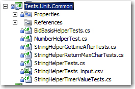
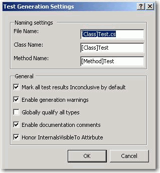
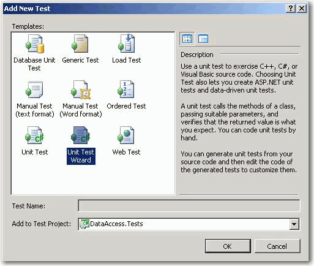
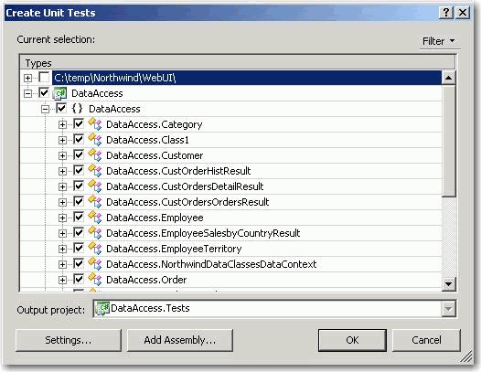

Hi Adam,  As well as keeping your code tidy, using this naming convention also allows you to use TestDriven.Net's 'Go To Test/Code' command. This navigates between your tests and code under test (and back). This is something that test-driven developers end up doing a lot. Screen captures at <a href="https://weblogs.asp.net/nunitaddin/testdriven-net-3-0-all-systems-go">https://weblogs.asp.net/nunitaddin/testdriven-net-3-0-all-systems-go</a>  - Jamie Cansdale 

 <excerpt class='endintro'></excerpt> 
<table cellspacing="0" width="100%" class="ssw15-rteTable-default"><tbody><tr><td class="ssw15-rteTable-default" style="width:33.3333%;"> 
            <strong>Test Object</strong></td><td class="ssw15-rteTable-default" style="width:33.3333%;"> 
            <strong>Recommended Style</strong></td><td class="ssw15-rteTable-default" style="width:33.3333%;"> 
            <strong>Example</strong></td></tr><tr><td class="ssw15-rteTable-default">Project Name</td><td class="ssw15-rteTable-default">Tests.[Testtypes].Projectname</td><td class="ssw15-rteTable-default">Tests.Unit.Common,Tests.Unit.WebFrontend,Test.Integration.MainWCFService Tests.Functional.SilverlightUI, Tests.Functional.WebUI *</td></tr><tr><td class="ssw15-rteTable-default">Test Fixture Name</td><td class="ssw15-rteTable-default">[Type]Tests</td><td class="ssw15-rteTable-default">OrdersTests, CustomerTests, DeveloperTests</td></tr><tr><td class="ssw15-rteTable-default">Test Case</td><td class="ssw15-rteTable-default">[Function]Test</td><td class="ssw15-rteTable-default">NullableIntTryParse_NumberIsValid1_Return1, StringHelperEncodeTo64_EncodeAndUnencodeString_ReturnSameString</td></tr><tr><td class="ssw15-rteTable-default">Set Up</td><td class="ssw15-rteTable-default">SetUp</td><td class="ssw15-rteTable-default"> </td></tr><tr><td class="ssw15-rteTable-default">Tear Down</td><td class="ssw15-rteTable-default">TearDown</td><td class="ssw15-rteTable-default"> </td></tr></tbody></table>
 
     

*Test types are categorized into "Unit" "Integration" or "Functional" tests, as explained in "<a href="https://www.ssw.com.au/ssw/Standards/Rules/RulesToBetterUnitTests.aspx#TypesOfTests">2. What are the different types of test you can have?</a>"

The main reason why we are categorizing tests is so that we can run different test suites. Eg.
<ul><li>Unit tests on Gated Checkin</li><li>Integration tests after each check in on the build server</li><li>All tests including the functional tests in the nightly build</li></ul>
 
   <strong>Samples for Naming of test projects</strong> Test.Unit.WebUI: This test project, tests the WebUI project, and is independent of external resources. That means all tests must pass. Test.Integration.WebUI: This test project tests the WebUI and depends on other external resources (Eg. probably needs a database, web services, etc.). That means if any external resource is unavailable, the tests will fail. Tests.Functional.SilverlightUI: Tests the Silverlight UI from an end-user perspective by clicking around in the application
<dl class="goodImage"><dt>
      
   </dt><dd>Figure: Good example - Naming for a Unit Test Project</dd></dl> 
Samples Naming of test methods​​​

 [TestMethod]  public void Test_Client()
<dd class="ssw15-rteElement-FigureBad">Bad example: There is no way to guess what this test does; you have to read the source​​ </dd>
 [TestMethod]  public void PubSubServiceConnectTest_AuctionOk_AuctionInfoReturned()
<dd class="ssw15-rteElement-FigureGood">Good Example: We are testing PubSubSe​rvice.Connect under the scenario that the "Auction status is OK" with an expected behaviour that data is returned</dd>
Sample Code for Integration Tests:

using System; using System.Collections; using System.Data; using System.Data.SqlClient; using NUnit.Framework; using SSW.NetToolKit.BusinessService; using SSW.NetToolKit.DataAccess; namespace SSW.NETToolkit.IntegrationTests   {   [TestFixture]   Public class CustomerTests     {     BusinessRules business=new BusinessRules(); 
        [Test]     public void OrderTotal_SimpleExampleInput()         {         decimal calculatedGrandTotal = business.CalculateOrderGrandTotal(10248);         int expected = 440;         Assert.AreEqual(expected, calculatedGrandTotal, "Calculated grand total didn't match the expect         }     [Test]     public void OderTotal_Discounts()         {         decimal calculatedGrandTotal = business.CalculateOrderGrandTotal(10260);         decimal expected = 1504.65m;         Assert.AreEqual(expected, calculatedGrandTotal, "Calculated grand total didn't match the expecte         }     [Test]     public void RoundingTest_RoundUp()         {         Assert.AreEqual(149.03, business.ApplyRounding(149.0282m), "Incorrect rounding rules applied for         }     [Test]     public void RoundingTest_RoundDown()         {         Assert.AreEqual(149.02, business.ApplyRounding(149.0232m), "Incorrect rounding rules applied 
            }     [Test]     public void RoundingTest_NoRoundingNeeded()         {         Assert.AreEqual(149.02, business.ApplyRounding(149.02m), "Incorrect rounding rules applied for 
            }     [Test]     public void RoundingTest_BorderCondition()         {         Assert.AreEqual(149.02, business.ApplyRounding(149.025m), "Incorrect rounding rules applied for         }     }   } 

​
<dl class="image"><dt></dt><dd>Figure: This rule is consistent with the Visual Studio default</dd></dl> 
   <b>Tip: </b>You can create a test project using the Unit Test Wizard: Test &gt; Add New Test

<dl class="image"><dt>​​</dt><dd>Figure: Unit Test Wizard 1</dd></dl><dl class="image"><dt></dt><dd>Figure: Unit Test Wizard 2</dd></dl>

