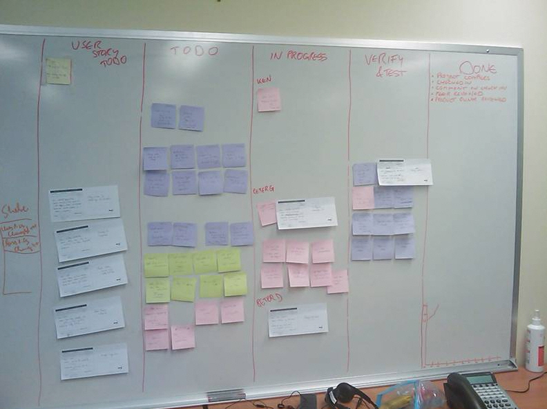

Having     an electronic task board makes it easy for developers to keep track of tasks.

These are the columns (aka swim lanes) you need:

<!--endintro-->
<dl class="goodImage">&lt;dt&gt;&lt;/dt&gt;<dd>Figure: Good Example - a virtual client task board in action (<a href="http://tfspreview.com/">TFS</a>)</dd></dl><dl class="goodImage">&lt;dt&gt;
      
   &lt;/dt&gt;<dd>Figure: OK Example - a physical client task board in operation</dd></dl>
Near your task board, stick an SSW "Want to submit a User Story?"

* Where to find their project portal
* Who to contact with questions
* How to add tasks to the task board

Print out this PDF and fill in the 2 fields and stick it on own task board.

[
Download the "SSW Submit a PBI" PDF.](/Documents/SSWSubmitaPBI.pdf) 
<dl class="image">&lt;dt&gt; 
      
   &lt;/dt&gt;<dd>Figure: Create an avatar for each person and stick them on the current task. You can find our 
      <a shape="rect" href="http://www.ssw.com.au/ssw/Standards/Rules/RulesToBetterProjectManagementWithTFS.aspx#PrintedStoryCard">User Story Cards here</a>. You can write the TFS work item ID on each card.</dd></dl>
