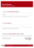

Having 
   an electronic ​​​task board makes it easy for developers to keep track of tasks. 

These are the columns (aka swim lanes) you need:

 <excerpt class='endintro'></excerpt> 
<dl class="goodImage"><dt>​</dt><dd>​​​Figure: Good Example - a virtual client task board in action (<a href="http://tfspreview.com/">TFS​</a>)​</dd></dl><dl class="goodImage"><dt>
      
   </dt><dd>​​Figure: OK​ Example - a physical client task board in operation</dd></dl>
Near your task board, stick an SSW "Want to submit a User Story?"
<ul><li>Where to find their project portal </li><li>Who to contact with questions​ </li><li>How to add tasks to the task board </li></ul>
Print out this PDF and fill in the 2 fields and stick it on own task board.

 
   <a href="/Documents/SSWSubmitaPBI.pdf">
      Download the "SSW Submit a PBI" PDF.</a> 
<dl class="image"><dt> 
      
   </dt><dd>Figure: Create an avatar for each person and stick them on the current task. You can find our 
      <a shape="rect" href="http://www.ssw.com.au/ssw/Standards/Rules/RulesToBetterProjectManagementWithTFS.aspx#PrintedStoryCard">User Story Cards here</a>. You can write the TFS work item ID on each card.</dd></dl>

