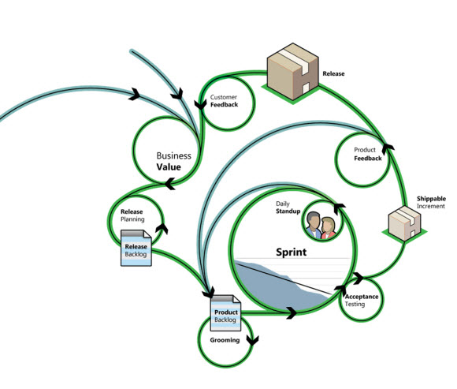
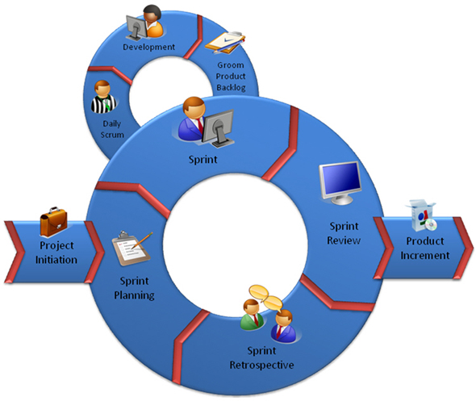

We all know that a visual image can make a complex process easy to understand. Having a visual image of the Scrum process helps everyone, including the Product Owner and interested stakeholders, understand the process and make sure the steps are being followed.

Here is an image for your war room wall...  

<!--endintro-->

::: bad  
  
:::

::: ok  
  
:::

::: bad

:::

Find and print the PDF on the ["SSW 8 Steps to Scrum" rule](/8-steps-to-scrum), then put it on your 'War Room' wall.

If you like this, retweet:  

`oembed: https://twitter.com/AdamCogan/status/94109372908711936`
