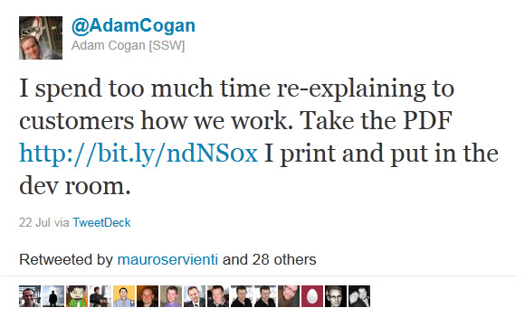

We all know that a visual image can make a complex process easy to understand. Having a visual image of the Scrum process helps everyone, including the product owner and interested stakeholders, understand the process and make sure the steps are being followed. 

Here is an image for your war room wall...  
<!--endintro-->

::: bad  
  
:::

::: bad  
  
:::
Good Figure: This Scrum image includes all the important steps from the initial meeting to the Review and Retro. Print this "[SSW 8 Steps to Scrum pdf](https://github.com/SSWConsulting/SSW.Rules.Content/raw/main/rules/the-war-room-does-your-scrum-room-have-the-best-scrum-image/8StepstoScrum.pdf)" and put it on your 'War Room' wall
  

### Related Links

* [Do you know the 3 steps to a PBI?](/do-you-know-the-3-steps-to-a-pbi)
