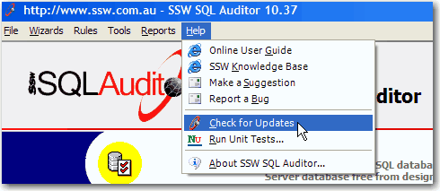

A standard menu item "Check for Updates" should be available in the Help menu. Its function is running SSW Diagnostics to check updates and keep the system up to date easily. More on [Do you allow users to check for a new version easily?](/do-you-allow-users-to-check-for-a-new-version-easily)

<!--endintro-->



Here's the code to run Diagnostics:

```cs
System.Diagnostics.Process.Start("http://us.ssw.com.au/ssw/diagnostics/download/SSWDiagnostics.application#SSWDiagnostics.application");
```
