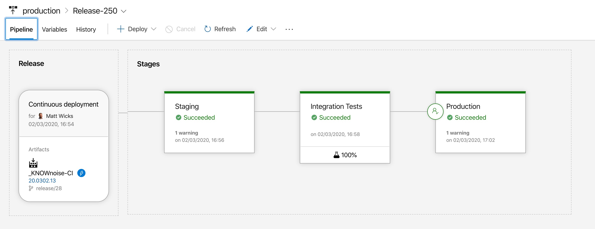

​​Once you’ve identified the manual processes in Stage 1, you can start looking at automation. The best tool for build and release automation is Azure DevOps.
 <excerpt class='endintro'></excerpt> 

 ​​See our 
      <a href=/rules-to-better-continuous-deployment-with-tfs-2012-and-tfs-2013> 
         Rules to Better Continuous Deployments with TFS</a>. 
      
<dl class="image"><dt> 
       
   </dt><dd>Figure: In Azure DevOps you can automate application deployment to a staging environment and automatically run tests before deploying to production​ </dd>​</dl>​ 

