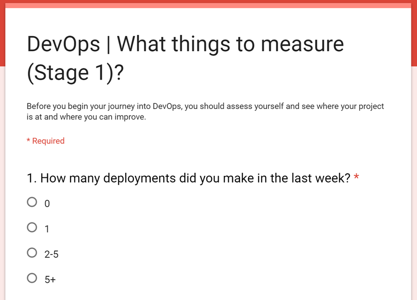
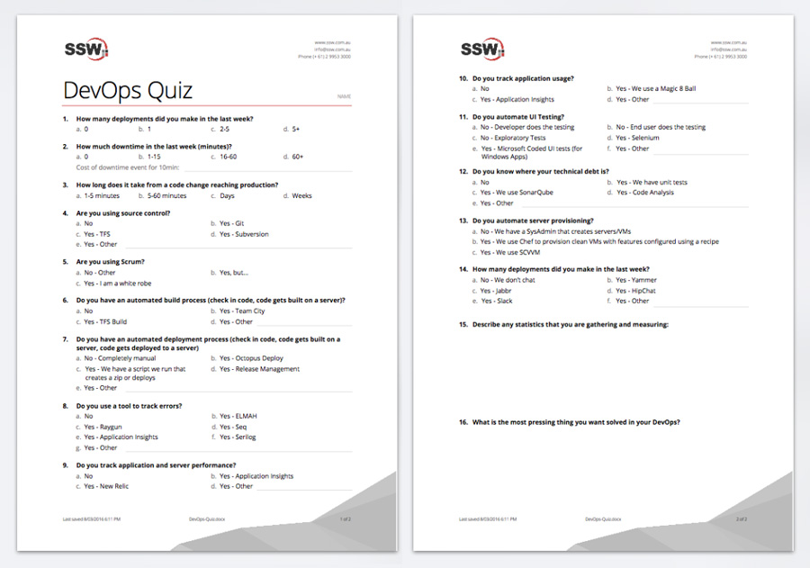

Before you begin your journey into DevOps, you should assess yourself and see where your project is at and where you can improve.

<!--endintro-->

Take [this survey to find out your DevOps index](http://goo.gl/forms/NrJhwHeGu1). 

  

If you prefer you can [download and print this survey in PDF](DevOps-Quiz.pdf).

