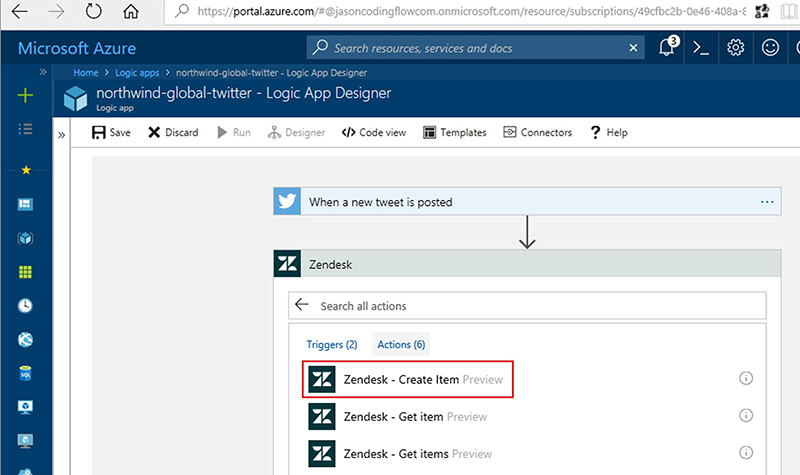

Providing your clients a personal service is really important, but it's expensive. Great deflected tickets give a more consistent experience and quicker experience, plus they are cheaper compared with support personnel. 

<!--endintro-->

**Step 1:** You should find the most common requests and make sure they can be deflected by creating FAQs or blog posts.

This way you help your users to access the information they need and help themselves before submitting a ticket, avoiding the contact with your support team.

**Step 2:** Use a ticket system that supports deflected tickets. Zendesk is the leading solution with deflected tickets. ServiceNow is another good one.

  

::: greybox
**Note:** SSW uses and can [help you with Zendesk](https://www.ssw.com.au/ssw/Consulting/Zendesk.aspx).
:::

`youtube: https://www.youtube.com/embed/WVpPWxPxs2k`
