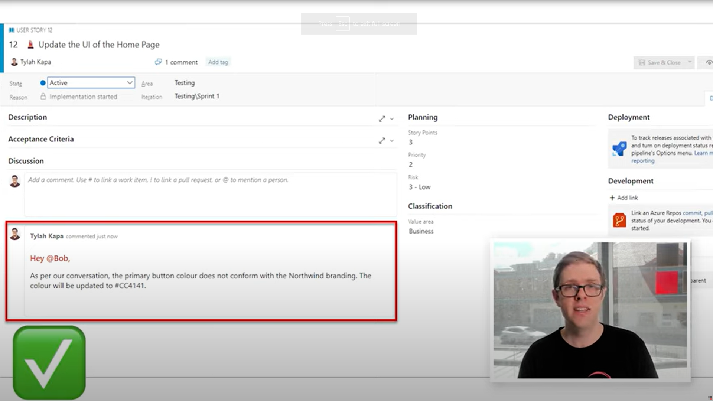
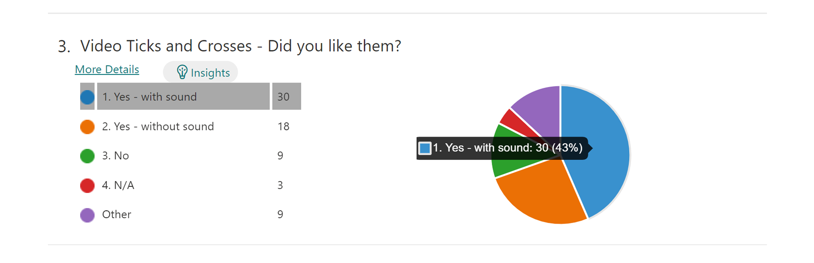
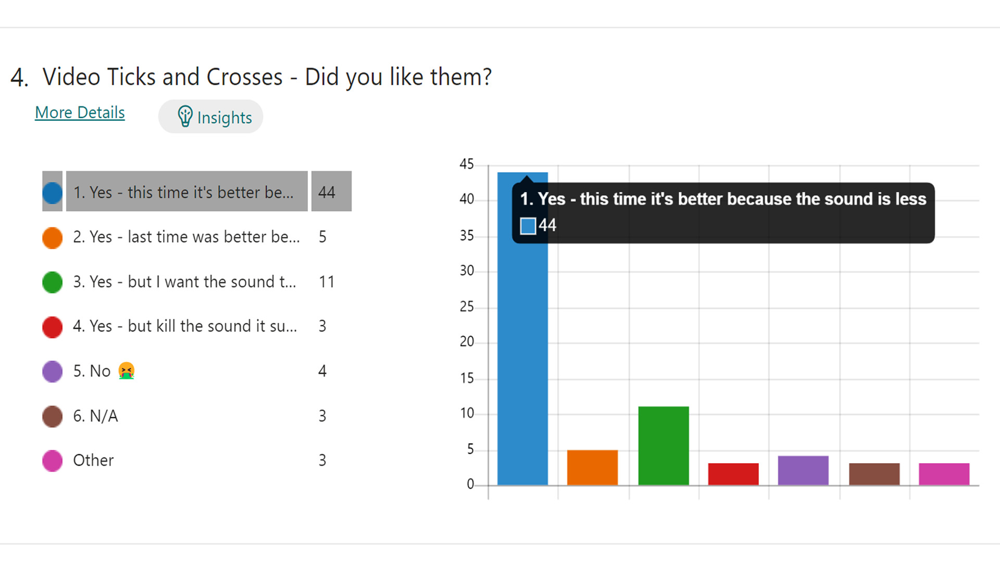
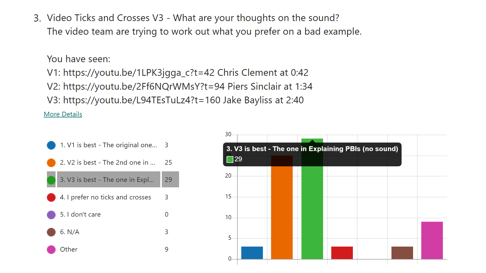

Using ticks and crosses can better emphasize your content. But using ticks and crosses in the wrong way may lead to bad experiences for your audience. 

<!--endintro-->

## The good example of video ticks and crosses

A good tick and cross example must:

1. Graphic:  Undistracting size and location
2. Sound: subtle

**NOTE: The tick and cross come out after the example is explained**

If not use ticks, crosses and sounds, your audience can't quickly tell if you're giving a good example from a bad one.

**❌ Video: Bad example - No tick and cross + no sound - [0:38 - 0:48](https://youtu.be/FXMMZvE1lig?t=38)**

If you use a distracting tick or a distracting cross with a loud sound, your audience can not focus on the content.

**❌ Video: Bad example - Distracting tick + loud sound - [0:59 - 1:02](https://youtu.be/1LPK3jgga_c?t=59)**

Using tick and cross with the right size and subtle sound, can better emphasize the video content.

**✅ Video: Good example - Red cross with the right size + subtle sound - [1:54 - 2:02](https://youtu.be/2Ff6NQrWMsY?t=114)**

**✅ Video: Good example - Green tick with the right size + subtle sound - [2:08 - 2:12](https://youtu.be/2Ff6NQrWMsY?t=128)**

## SSW Research feedback: Video ticks and crosses

In the past two months, we have set three questions about tick and cross in four forms for SSW members. In summary, the data is divisive. For the sound on the ticks and crosses, it looks like the half of people prefer subtle sounds and the half of people prefer without sound.

Here's some feedback from the research that might enlighten you:

### 1. With sound or without sound: Video Ticks and Crosses - Did you like them?

**Video #1: Distracting red cross with loud sound - [00:42 - 00:47](https://youtu.be/1LPK3jgga_c?t=42)**

Compared with no sound, SSW people prefer video #1. Nearly 43% of SSW people prefer to have sound on the ticks and crosses. 

Of the 9 other responses, 2 of them prefer without sound, and the other 6 preferred with sound, but they all thought the sound lasted too long.

### 2. Subtle sound or loud sound: Video Ticks and Crosses - Did you like them?

**Video #2: The red cross with the right size and subtle sound - [01:36 - 01:46](https://youtu.be/2Ff6NQrWMsY?t=96)**

Compared to the [loud sound video](https://youtu.be/1LPK3jgga_c?t=42), nearly 60% of SSW people thought the sound this time is better because it is less. 

Of the 3 other responses, they all prefer this time it’s better because the sound is less, and 2 of them thought it could get even better.

### 3. Comparison: Video Ticks and Crosses V3 - What are your thoughts on the sound?

**Video #3: The red cross and bad example in the lower third, without sound and no colour - [02:41 - 03:07](https://youtu.be/L94TEsTuLz4?t=161)**

Compare to [video #1](https://youtu.be/1LPK3jgga_c?t=42) and [video #2](https://youtu.be/2Ff6NQrWMsY?t=96), nearly 40% of SSW people thought video #3 is the best and nearly 35% of SSW people thought video #2 is the best. 

Of the 9 other responses, they were quite conflicted but video #3 was slightly preferred.

