Sometimes a video editor wants to communicate good and bad examples to the audience, but they aren't sure the best way to do that. Ticks (✅) and crosses (❌) with sound effects are a great way to highlight good and bad examples to the audience, but they only work if used correctly.

<!--endintro-->

Using ticks and crosses in the **will help you emphasize an example and aid comprehension of the content**. Including sound effects in the **wrong way may interfere with the audience's understanding of the example**

A good tick and cross example will have:

* A graphic - Not intrusive on the content and left aligned
* A subtle sound - Significantly lower than the human voice 

**Note:** Using a blend of tick and cross visuals with sound cues will reinforce for your audience which example is good and which is bad. 

### ❌ Bad example #1 - No visuals or sounds 

**Video: [SSW TV - Do you have a product roadmap? | 0:38 - 0:48](https://youtu.be/FXMMZvE1lig?t=38)**

The video presents good and bad examples without using other visual elements or sound effects which may cause them to get distracted while watching or have to back-track.

::: bad
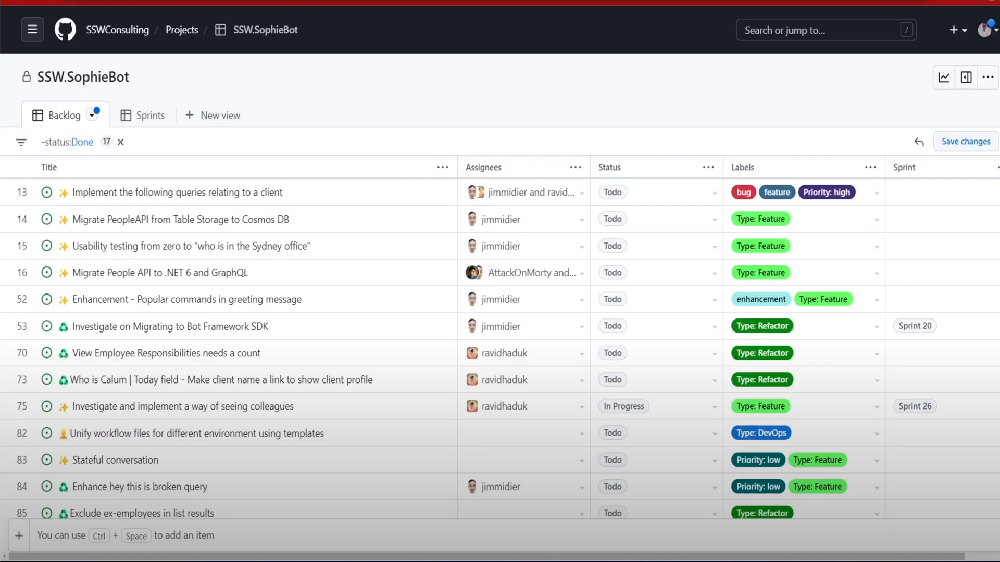
:::

### ❌ Bad example #2 - Distracting visuals and obnoxiously loud sounds

**Video: [SSW TV - Do you check before installing 3rd party libraries? | 0:59 - 1:02](https://youtu.be/1LPK3jgga_c?t=59)**

Ticks and crosses with sound effects are used in the video, but there are still problems: 

* Distracting ticks and crosses - the visuals are too large and placed in the middle of the frame so they draw the audience's attention away from the content.
* Loud sound - When the sound effect is significantly louder than the human voice, it can cause an unpleasant auditory effect.

Therefore, it is important to use an appropriately sized graphic left-aligned (since we read left to right) with a subtle sound effect.

::: bad

:::

### 😐 OK Example

**Video: [SSW TV - Documenting decisions and discoveries with Piers Sinclair | 1:54 - 2:02](https://youtu.be/2Ff6NQrWMsY?t=114)**

This is an OK example using crosses in a video: 

* Good size - smaller than the figure in the picture, not visually obtrusive 
* Good location - in the margin below the email signature, not covering the example, but drawing the audience's attention to it 
* Subtle sound effect - the sound effect is lower than the speaker's voice 

However...it would be an even better approach to standardise your ticks and crosses so you can use the same graphic across every video. 

::: ok
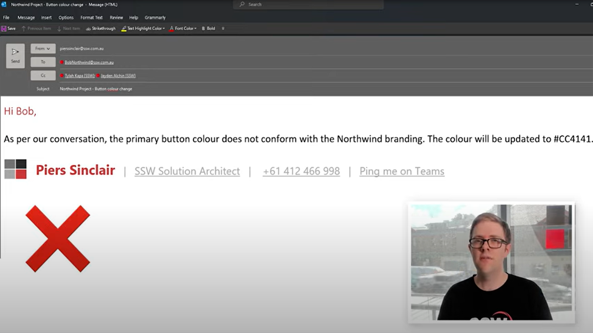
:::

### ✅ Good Example - Lower Thirds

**Video: [SSW TV - Do you ask for small content changes using from X to Y? | Ulysses Maclaren | SSW Rules
| 0:58 - 1:07 ](https://youtu.be/zP5xdELqlBY?t=57)**

Standarding your ticks and crosses using a lower third helps the team have a consistent sound and visual across every video.

::: good

:::

---

::: greybox

### Extra - SSW TV Research: Feedback on videos using ticks and crosses

In a weekly internal form known as "'Chewing the Fat', the SSW TV Team set three questions for SSW employees to answer: 

* **Question #1** - With sound or without sound: Video Ticks and Crosses - Did you like them?
* **Question #2** - Subtle sound or loud sound: Video Ticks and Crosses - Did you like them?
* **Question #3** - Comparison: Video Ticks and Crosses V3 - What are your thoughts on the sound?
* **Question #4** - Which subtle sound is perfect: Video Ticks and Crosses - Did you like them?

#### Results - Question #1 - With sound or without sound: Video Ticks and Crosses - Did you like them?

**Video #1: [SSW TV - Do you check before installing 3rd party libraries? | 00:42 - 00:47](https://youtu.be/1LPK3jgga_c?t=42)**

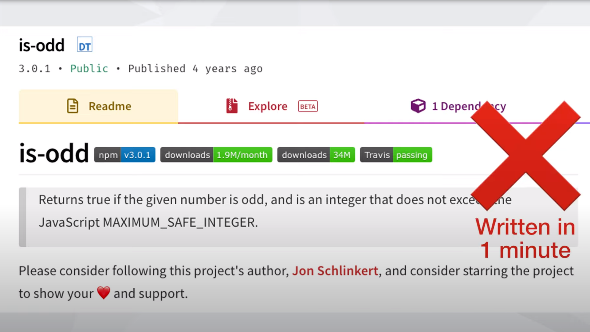

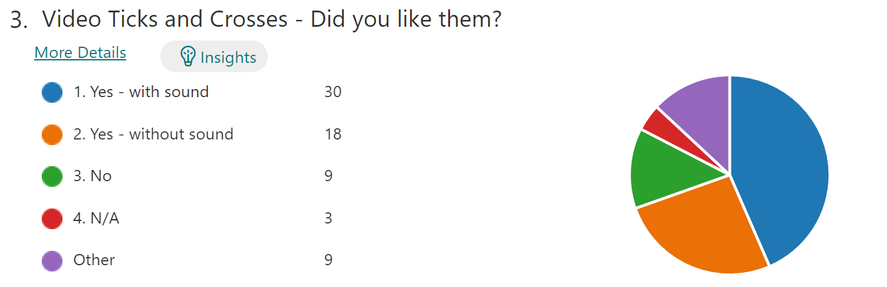

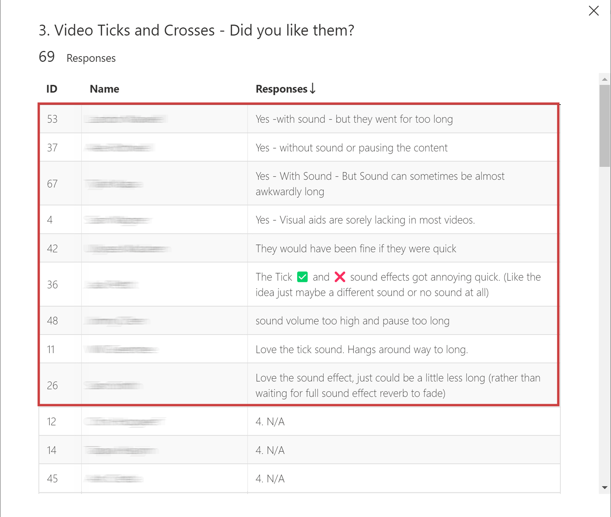

After watching video #1, people preferred having a sound rather than having no sound. Of the 9 other responses, 6 preferred with sound but they all thought the sound lasted too long, 2 of them prefer without sound, and the other 1 didn't comment on the sound.

The final results (including other) were:

* 55% prefer to have sound
* 31% prefer to have no sound
* 14% prefer no ticks and crosses at all

#### Results - Question #2 - Subtle sound or loud sound: Video Ticks and Crosses - Did you like them?

**Video #2: [SSW TV - Documenting decisions and discoveries with Piers Sinclair | 01:36 - 01:46](https://youtu.be/2Ff6NQrWMsY?t=96)**

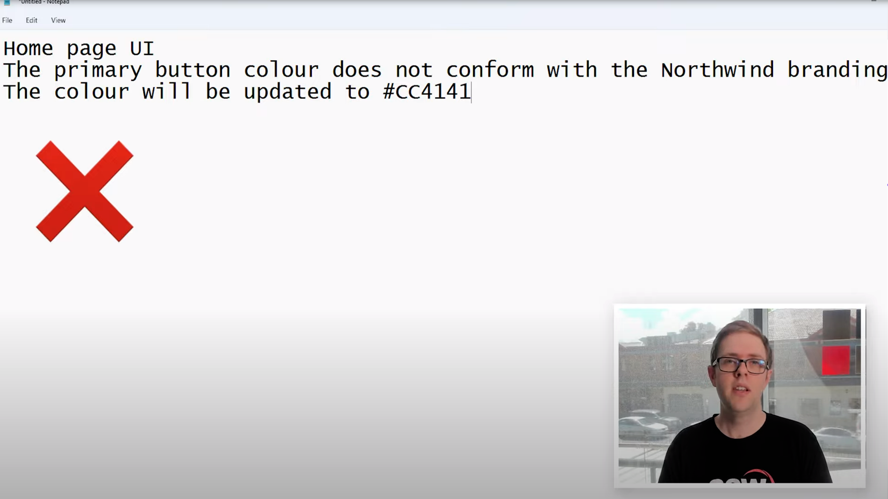

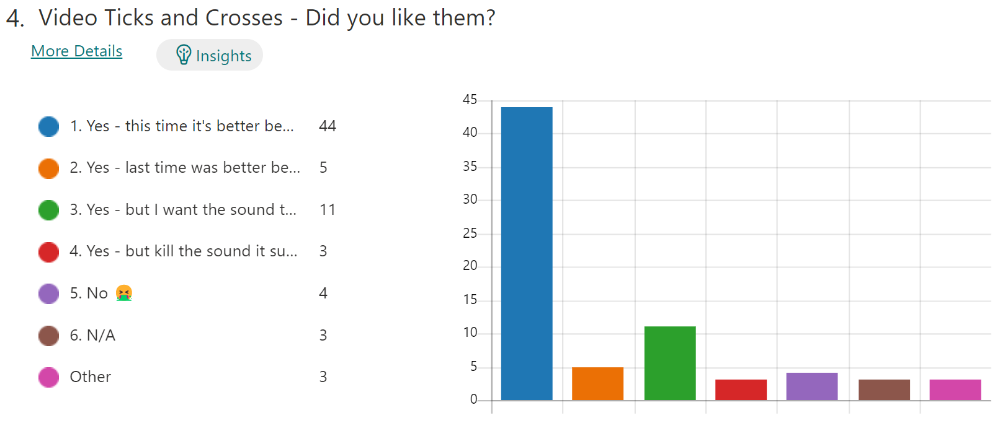

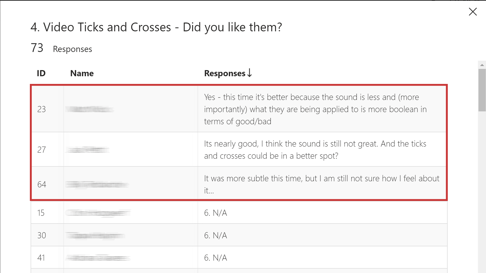

After watching video #2, people preferred having a subtle sound rather than [having a loud sound](https://youtu.be/1LPK3jgga_c?t=42). Of the 3 other responses, 2 of them prefer the subtle sound and think it could get even better and the other 1 didn't comment on the sound.

The final results (including other) were:

* 78% prefer to have subtle sound
* 11% prefer no ticks and crosses at all
* 7% prefer to have loud sound
* 4% prefer to have no sound 

#### Results - Question #3 - Comparison: Video Ticks and Crosses V3 - What are your thoughts on the sound?

**Video #3: [SSW TV - Explaining a PBI to a Product Owner with Jake Bayliss | Explaining a PBI to a Product Owner with Jake Bayliss | 02:41 - 03:07](https://youtu.be/L94TEsTuLz4?t=161)**

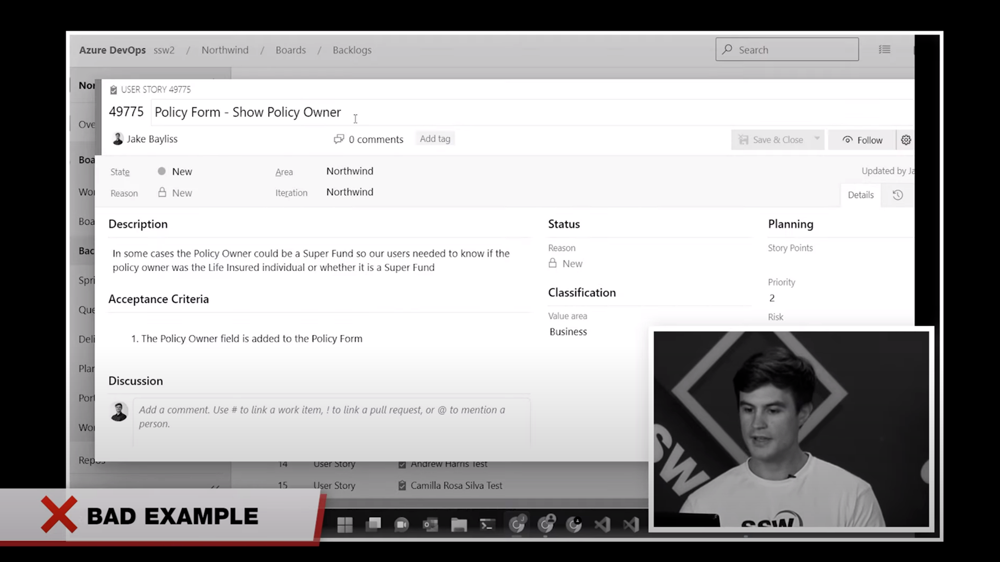

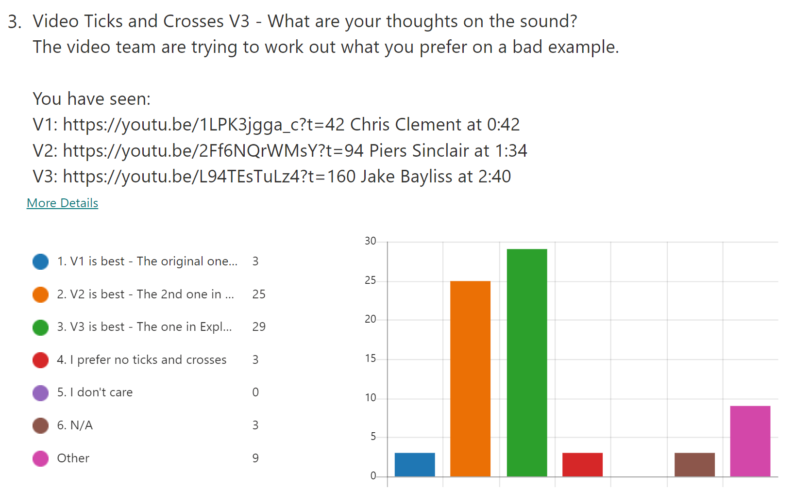

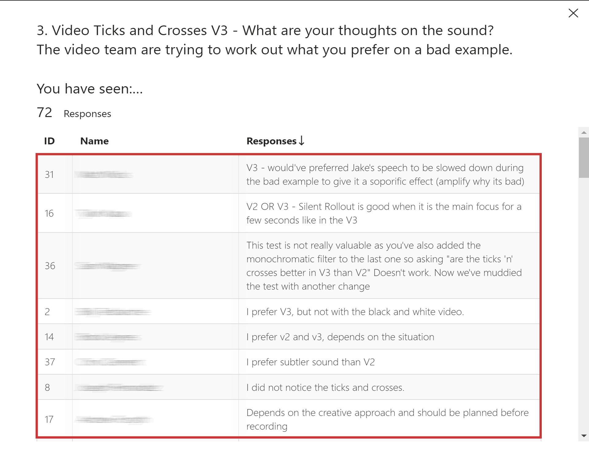

After watching video #3, people preferred having a subtle sound or the new tick-cross style with no sound. Of the 9 other responses, they were quite conflicted but video #3 was slightly preferred.

The final results (including other) were:

* 46% prefer to have no sound and use the new tick-cross style
* 39% prefer to have subtle sound
* 11% prefer to have no ticks and crosses
* 4% prefer to have loud sound

#### Results - Question #4 - Which subtle sound is perfect: Video Ticks and Crosses - Did you like them?

**Video #4: [SSW TV - No Hello - Boost Productivity: Say Goodbye to Time Wasting with this Simple Trick | SSW Rules | 1:05 – 1:21 ](https://youtu.be/oOEpdViHeVI?t=65)**

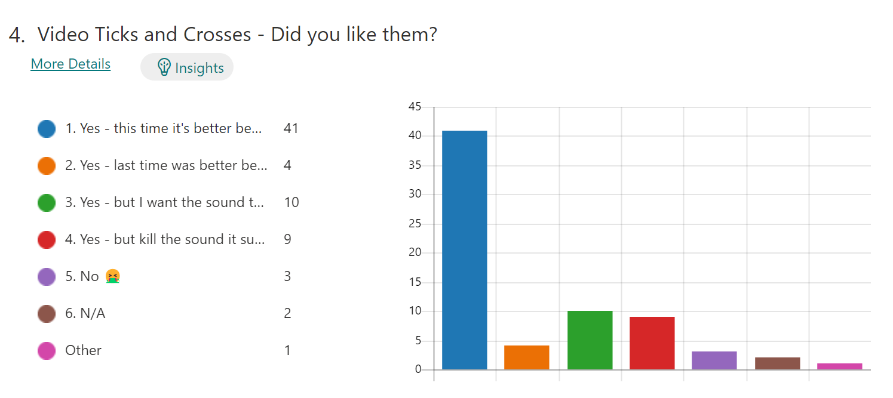

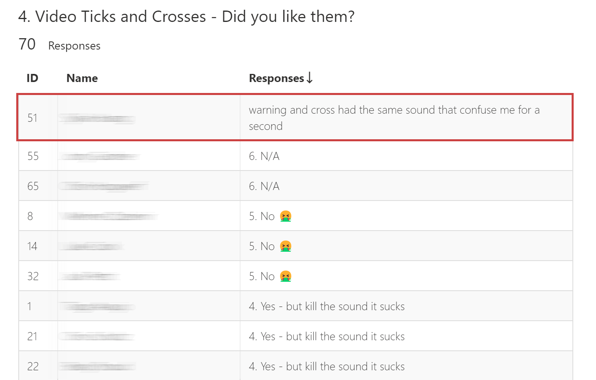

After watching video #3, people prefer the subtle sound this time to [the subtle sound in video#2](https://youtu.be/2Ff6NQrWMsY?t=96). Of the 1 other response, no accurate assessment of how good or bad the two sounds were.

The final results (including Other) were:
* 60% prefer to have subtle sound in video #4
* 14% prefer to have a more subtle sound
* 13% prefer to have ticks and crosses without sound
* 7% prefer no ticks and crosses at all
* 6% prefer to have subtle sound in video #2

:::
