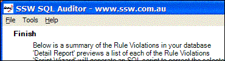
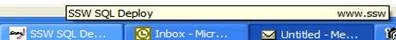

When advertising and promoting your application using screenshots, you will want to have the URL for your company website displayed. This makes for good, free publicity.

 <excerpt class='endintro'></excerpt> 
​

If you want the URL to be shown as often as possible, you can place it in the title-bar of your form. That way, your URL will be visible in all screenshots that show the title-bar.
<dl class="goodImage"><dt>
      
   </dt><dd>Figure: Good Example - The company URL appearing in SSW SQL Auditor</dd></dl>
Note: Make sure the URL won't take other important information's place.

Note 2: Through certain coding tricks, it is possible to have the URL on the title-bar right aligned. This isn't a good idea, however, as it can produce undesirable results under certain conditions. For example, when the user hovers the mouse pointer over the form's button on the taskbar, the resulting tool tip looks somewhat distorted.
<dl class="badImage"><dt>
      
   </dt><dd>Figure: Bad Example - Bad caption in SSW SQL Deploy</dd></dl> 

