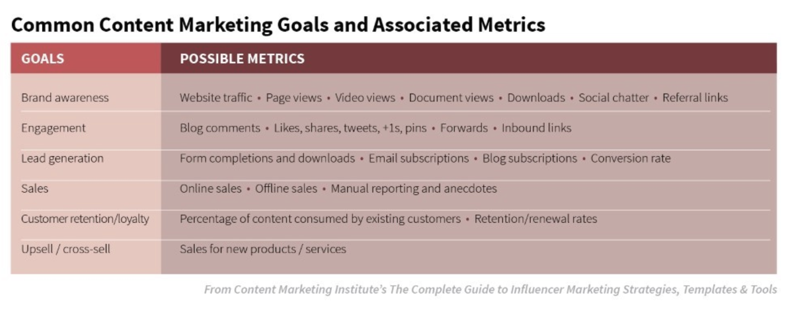
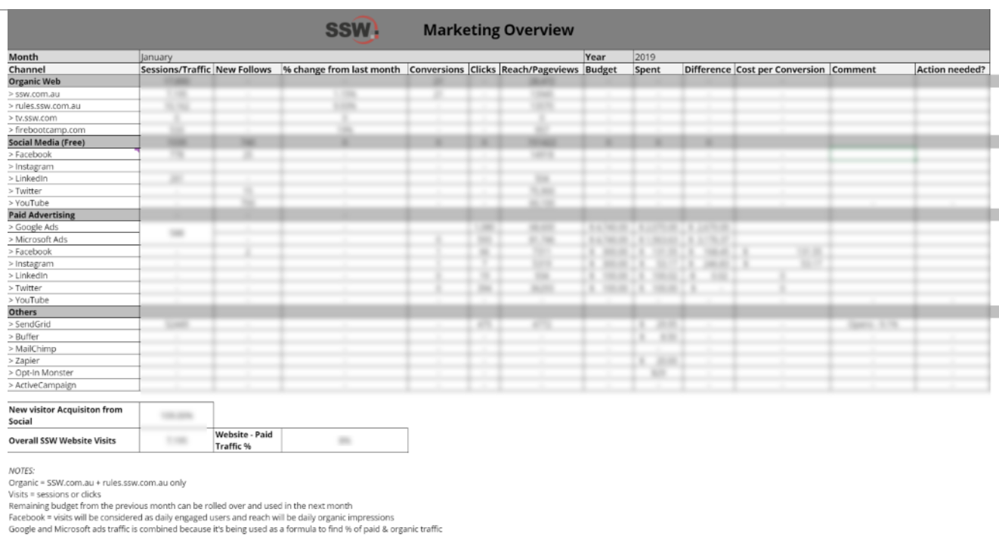

Given most companies sink a lot of money into marketing, it’s important to know if your strategy as outlined in your Marketing Plan is working for you.

<!--endintro-->

Firstly, you need to set realistic performance standards. What metrics are you going to use to measure your performance? You need to have these clearly documented in your marketing plan so that it is clear to the whole team how it will be measured and analyzed. This will dictate the way a campaign is created, its budget, and metrics.

We recommend setting SMART goals, this is an effective tool that provides the clarity, focus and motivation you need to achieve your goals. It can also improve your ability to reach them by encouraging you to define your objectives and set a completion date. SMART goals are also easy to use by anyone, anywhere, without the need for specialist tools or training.

To make sure your goals are clear and reachable, each one should be:
•	Specific (simple, sensible, significant).
•	Measurable (meaningful, motivating).
•	Achievable (agreed, attainable).
•	Relevant (reasonable, realistic and resourced, results-based).
•	Time bound (time-based, time limited, time/cost limited, timely, time-sensitive).

Source: MindTools (2016). SMART goals – *how to make your goals achievable*.

One simple way of tracking this, is to collate the performance data and analyze the results. For example, a goal might be to increase the engagement on your social media pages by 6% in 6 months, to ensure you’re on track you would need to see your audience growing by 1% every month.

To do this, you first need to decide how frequently you’d like to collect your data. Monthly is a good cadence to start with, as it can show trends without being too labor-intensive. However, some metrics might need to be looked at more frequently to ensure you’re on track.

Here is a diagram outlining some of the ways you can track your performance:

A simple way of tracking this, is to have a spreadsheet that holds all of your data. Measurement can be as simple or as complicated as you make it. Don’t measure simply for the sake of having some numbers to present to your upper management. If you aren’t certain what you should be measuring, ask yourself these two questions:

* Do these metrics support my key goals?
* Can I take action on these metrics (i.e., will they provide me insight into how I can improve my program)?

Unless you can answer “yes” to the questions above, you likely don’t need to be collecting the data — at least at first.   

