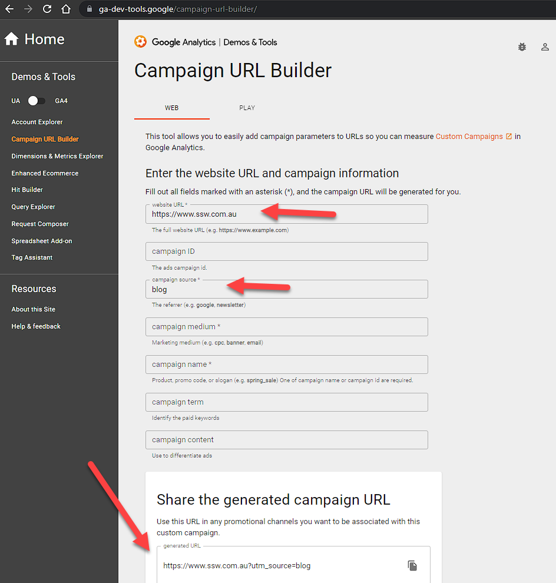

To ensure you are tracking the traffic taken to your website from a QR code, it's important to add UTM parameters to the URLs you are using to create your QR codes.

This will allow you to see users, bounce rate, sessions, events, conversions and more in Google Analytics.

<!--endintro-->

[Google's Campaign URL Builder](https://ga-dev-tools.google/campaign-url-builder/) is a free tool that allows you to easily add campaign parameters to URLs so you can measure [Custom Campaigns](https://support.google.com/analytics/answer/1033863) in Google Analytics.

