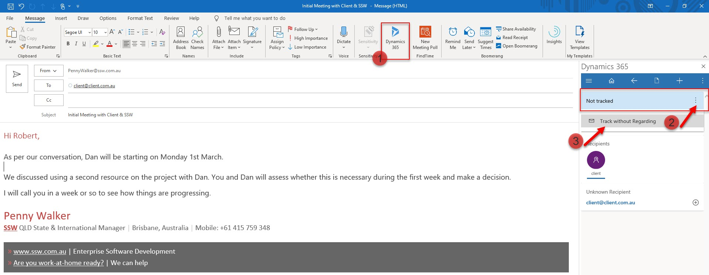
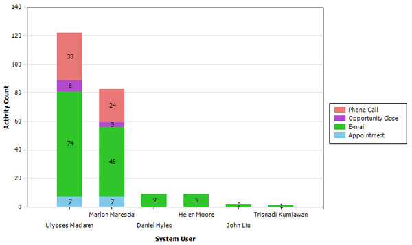

**Prerequisite:** [Install the CRM Add-in.](/install-the-2-add-ins)

The general principle is that you track important emails as per Do you track important email in CRM?

`youtube: https://www.youtube.com/embed/Mna0QBFB6CU`
 
Microsoft Dynamics 365 allows users to track activities such as appointments, phone calls, emails, etc. This feature can be easily abused by users to record unrelated activities inside CRM. It is difficult sometimes to work out which type of activities should be recorded. These are the types of activities you should track in CRM:

<!--endintro-->

* 01 Appointments: Initial meeting, and follow-up meetings...
* 02 Phone Calls: Any incoming and outgoing sales related phone call (note Dynamics has Skype for Business integration to automatically track outgoing phone calls)
* 03 Emails: Sales related emails

All sales activities should be tracked via CRM as an opportunity, company or contact.

By recording these activities, reports can be created to view:

* The guys doing the most sales activities.  
  E.g. The "Activities" report. This should be printed monthly and posted on the wall. (shown below)
* The history for all sales activities relating to an opportunity. This is useful to review before making a call (but is not necessary if you CC each other).
* Which opportunities have been neglected. This is a custom report and could be useful in a large company where opportunities could slip through the cracks.

  

**Note:** You can see more details on what emails to track in [Do you know to hit 'Track' when you receive an important email?](/track-important-emails)

