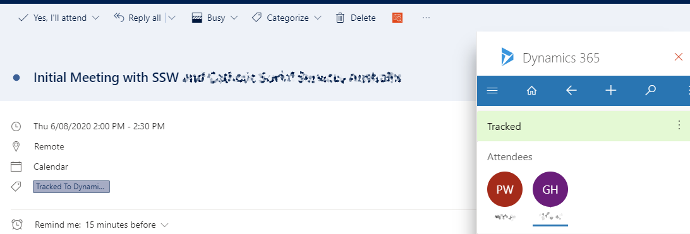
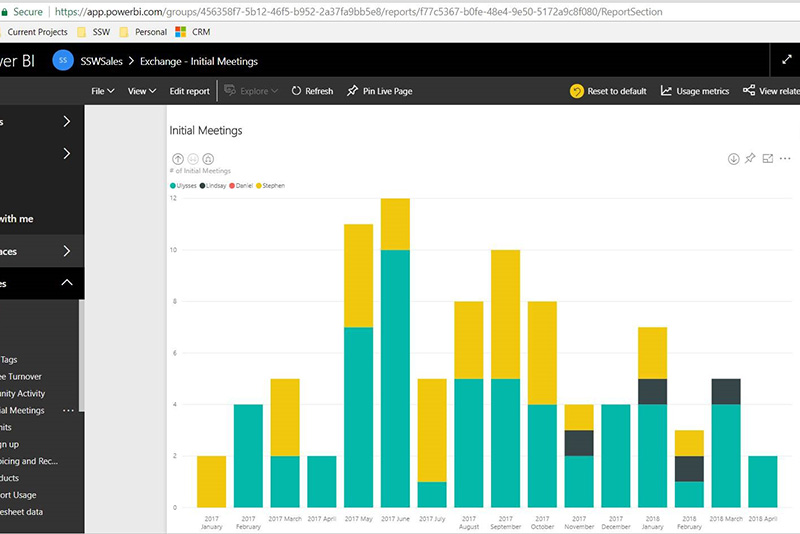

​When creating an appointment email for an initial meeting, make sure you include the words "<b>initial</b>" and "<b>meeting</b>" on the subject.   

<b>Subject:</b><b></b> Northwind project with SSW and Bob 

<dd class="ssw15-rteElement-FigureBad"> Figure: Bad subject - not clear it is an initial meeting </dd>

 
         <b>Subject:</b> ​Initial meeting with SSW and Bob from Northwind  <b>​Subject:</b> 
         Initial phone 
         meeting with SSW and Bob from Northwind

<dd class="ssw15-rteElement-FigureGood">Figure: Good subjects - Make clear it is an initial meeting by having both words​  </dd>

 <excerpt class='endintro'></excerpt> 

The Appointment should also be tracked (without regarding) in ​Dynamics 365 so that this information is readily available and reportable.
<dl class="image"><dt></dt><dd>Figure: Initial Meeting created in Outlook and tracked to Dynamics 365</dd></dl>

The idea behind it is that Power BI can then track and show this.
<dl class="image"><dt>
      
   </dt><dd>Figure: It's clear to see that there is no yellow in the past couple of months, which may indicate work drying up for Stephen's area </dd></dl>

