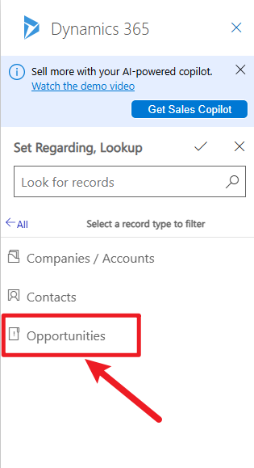
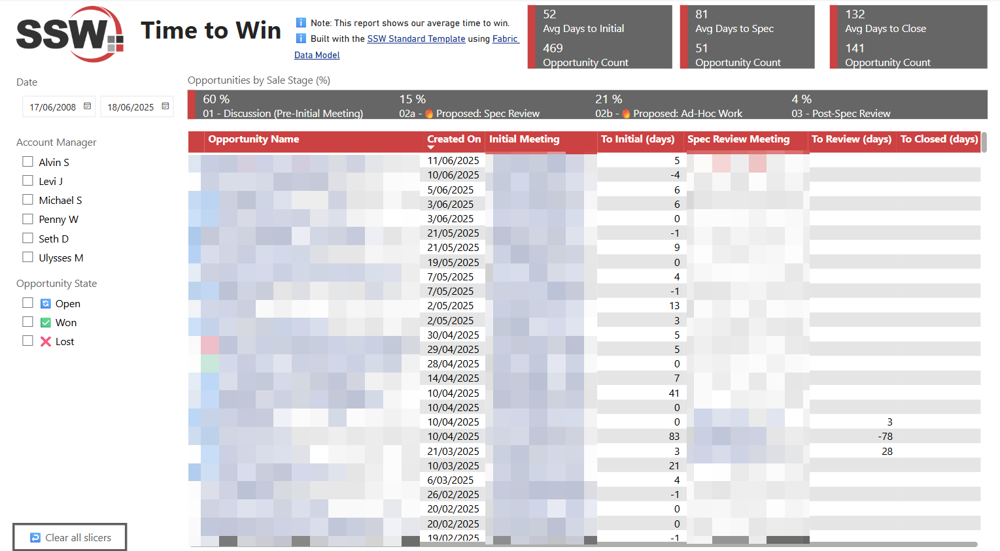
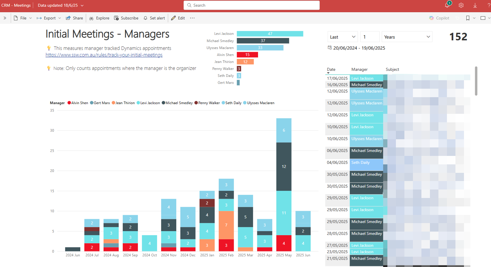

To ensure clarity and consistency in our calendar invites, please follow the naming conventions below when scheduling meetings:

* For an Initial meetings, include **“Initial Meeting”** in the subject line
* For a Specification Review, include **“Spec Review”** in the subject line

This helps everyone quickly identify the purpose of the meeting, improves calendar visibility, and supports accurate reporting.

<!--endintro-->

::: greybox
**Subject:** Northwind project with SSW and Bob
:::

::: bad
Figure: Bad example - Not clear it is an initial meeting
:::

::: greybox
**Subject:** <mark>Initial</mark> phone <mark>meeting</mark> with Adam from SSW and Bob from Northwind  
:::

::: good
Figure: Good example - Includes the words "initial meeting" and the names of attendees
:::

The Appointment should also be tracked (without regarding) in Dynamics 365 so that this information is readily available and reportable.

**Important: In Dynamics 365 (Outlook add-in), set the “Regarding” field to an opportunity, not an account.**

The idea behind it is that Power BI can then show the time elapsed between each sales milestone.

