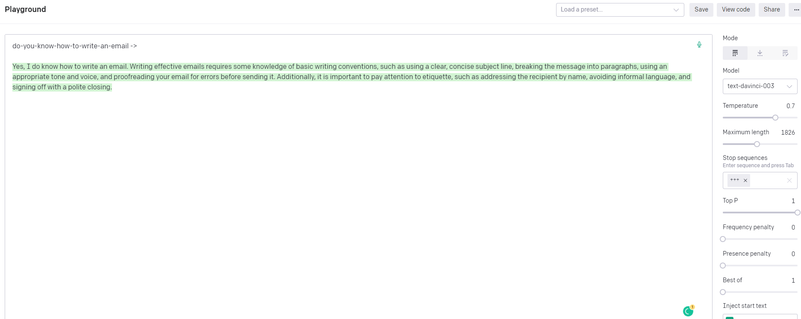
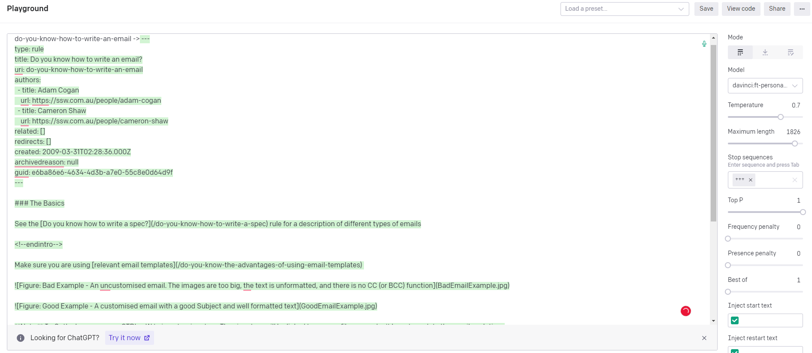

GPT is an awesome product that can do a lot out-of-the-box.  
However, sometimes that out-of-the-box model doesn't do what you need it to do.

In that case, you need to provide the model with more training data, which can be done in one of two ways.

<!--endintro-->

Usually, for common scenarios GPT will already be adequate, but for more complex or highly specific use cases it will not have the required training to output what you need.

### System Prompt

The system prompt is a prompt that is sent along with every request to the API, and is used to tell the model how it should behave.
Using the system prompt is the easiest way to provide additional data to GPT, but there are also some downsides to this approach.

**✅ Benefits**

* Easy to implement
* No extra setup cost
* Data can be easily changed or removed

**❌ Disadvantages**

* The system prompt counts towards total token count - not suitable for large amounts of data
* Large system prompts can limit the amount of tokens available for questions and responses
* Adds extra cost to each request
* Potential for inconsistency depending on what data is sent

### Fine Tuning

OpenAI provides a way for you to train new data into the model so that it is always available, without having to provide it with each request.

For example, if you want to build an app that outputs SSW rules based on a title, the untrained model probably won't know what SSW Rules are so you need to train it.

::: bad

:::

::: good

:::

**✅ Benefits**

* Suitable for larger amounts of data
* No extra cost per request as trained data lives on the server
* Consistent as trained data is available to all requests

**❌ Disadvantages**

* Harder to implement
* Extra setup cost to fine tune the model
* Model needs to be fine tuned again to change or remove data
* Fine tuning may not be available for every model
