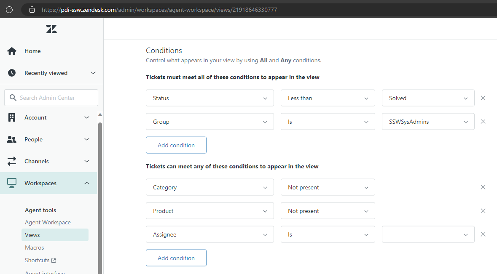
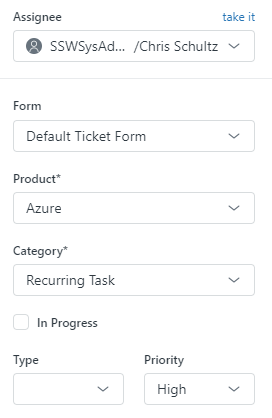

As a SysAdmin, triaging support tickets efficiently is crucial for streamlining the ticket management process. It is important to have a clear process for triaging tickets, including the fields that need to be populated when a ticket comes in.

<!--endintro-->

In Zendesk, you can create a view for triaging tickets - for example, create a view showing all unsolved tickets that have not been assigned to anyone.

### To triage tickets

1. Assign the ticket to the right person

* If the ticket is addressed to an individual, the ticket should be assigned to that person.
* If not, assess the ticket's technical requirements and identify the relevant subject matter expert.

:::info
It's OK to reassign the ticket if needed - but have a conversation first, and document the reason for the reassignment. 
:::

2. Add a Category

* Tickets should be categorised so that useful reporting can be done.
* Categories could include: User Access, Security, Feature Request, Recurring Tasks.

3. Add a Product

* Similarly, reports will be greatly enhanced if you can determine how much time is being spent on different products.
* Products could include: Azure, CRM, SharePoint, Zendesk.

4. Add a Priority

* Determine the priority level based on the impact, urgency, and predefined guidelines.
* Use a standardised priority system (e.g., low, medium, high, critical) to ensure consistent assessment.

5. Split the ticket if needed (rare)

* If the ticket contains tasks for multiple people, or if it contains multiple big project tasks, you might choose to split the ticket into 2 or more smaller tickets. 

You may choose to add other fields that are relevant to your environment.

