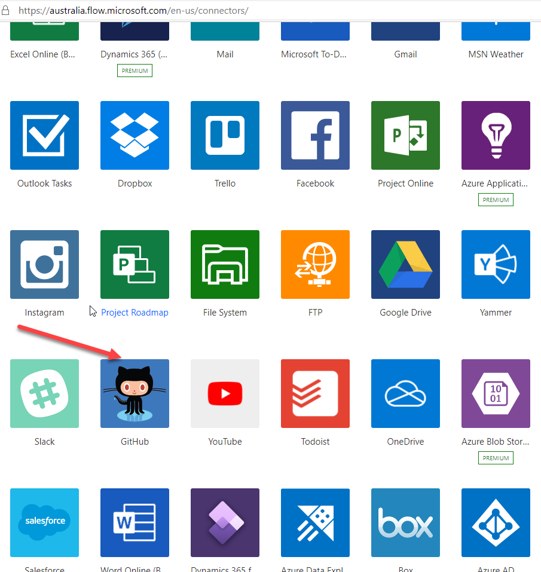
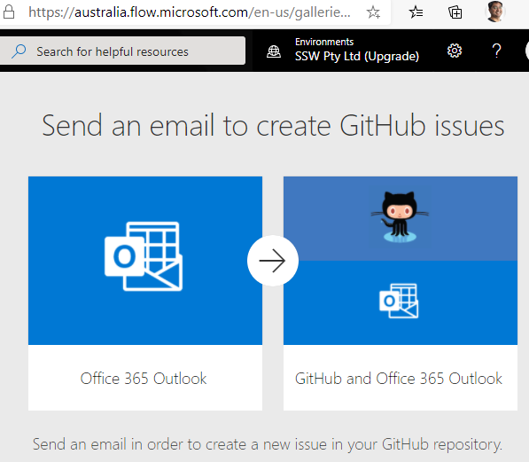
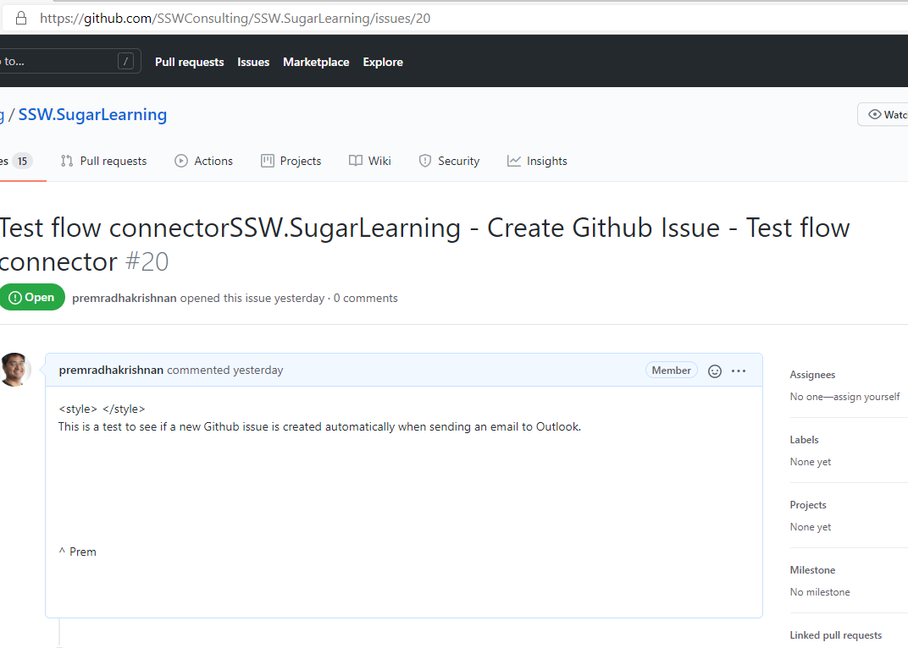
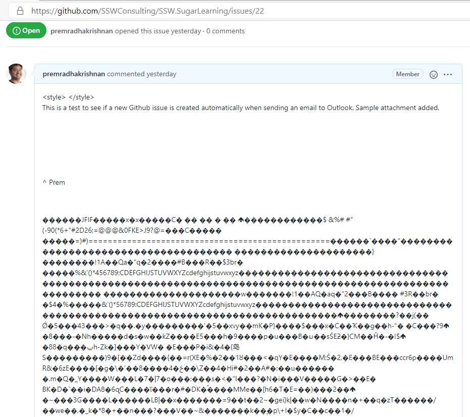

If a Product Owner sends an email to the development team with a request, that [email should be turned into a Github Issue](/turn-emails-into-pbis) before any work is started or the work is prioritized on the backlog. 

Power Automate has a connector to do this automatically when an email arrives in Outlook. It can create a new Github Issue by parsing the From, To, Subject and body of the email. 

However, at the moment there is a limitation that it doesn't read inline attachments in emails and therefore you have to create your issues manually in Github.

<!--endintro-->

  

  

🔥 Warning: This Flow connector does not suport inline images.

::: good  
  
:::

::: bad  
  
:::
