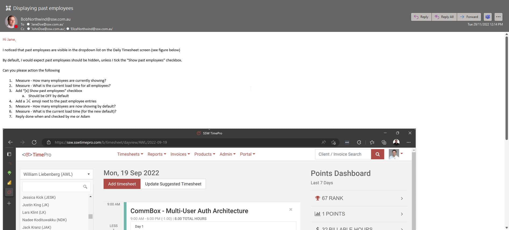
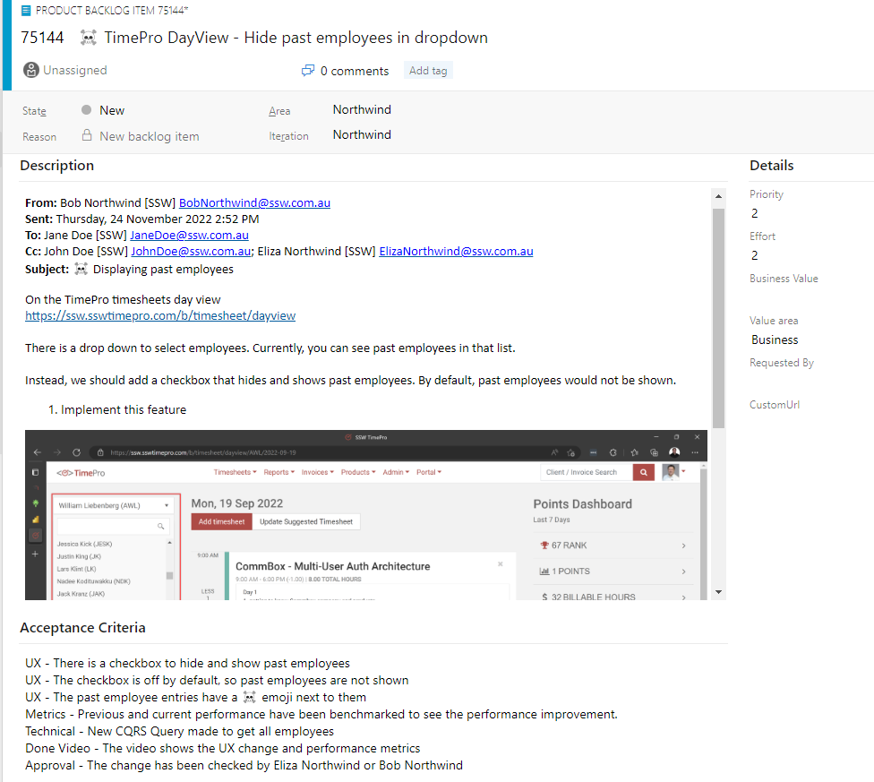

Emails are a natural way for people to give feedback about a product. Unfortunately, they also serve as a poor mechanism for performing work. As work is done, the thread can become untenable by splitting off into multiple different threads and becoming buried among other emails.

That's why when a feedback email is received, it is important to turn it into a Product Backlog Item (PBI) and communicate that back to the sender.

If someone often sends email tasks rather than creating PBIs, kindly suggest they create PBIs directly to save time and keep workflows organized.

<!--endintro-->

:::info

Of course, you should use your judgement to decide if the email needs to become a PBI - for example, feedback that contains confidential information, or does not include an actionable task would not go into the backlog.

:::

### Benefits of turning emails into PBIs

There are several benefits of turning an email into a PBI including:

::: good
Providing one source of truth
:::

::: good
Better Prioritization
:::

::: good
Easily accessible by anyone in the team
:::

### Steps to turn an email into a PBI

It's important that you follow the right steps so that the PBI contains all the information someone would need to find the original email thread, and also so that the original sender knows where the PBI is, and whether it has completed.

1. Create a PBI in the backlog and give it a name

2. Copy the **email header** into the top of the PBI, indent it and add the words "Based on email chain:" so that the email can be found later.

3. Replace the users with GitHub usernames (where possible), if you'd like to keep those users informed.

4. Remove any remaining email addresses from the header.

5. Fill out the Description

6. Fill out the Acceptance Criteria, adding: *"Reply 'Done' to the email and also @mention them in the PBI with 'Done'"*

7. Reply back to the original email saying: *"That's awesome feedback, I've moved it to a PBI: {{ URL }}\
   For future ones, if you have access, please add your comments there 🙂"*

::: greybox
**From:** Bob Northwind "<BobNorthwind@northwind.com>"\
**Sent:** Thursday, 24 November 2023\
**To:** Jane Doe "<JaneDoe@northwind.com>"\
**Cc:** John Davis "<JohnDavis@northwind.com>"; Eliza Northwind "<ElizaNorthwind@northwind.com>"\
**Subject:** TimePro PBI 50209: ☠️ Displaying past employees
:::
::: bad
Figure: Including email addresses and not tagging GitHub users
:::

::: greybox
Based on email chain:

**From:** @BobNorthwind\
**Sent:** Thursday, 24 November 2023\
**To:** @JaneDoe\
**Cc:** @JohnDavis @ElizaNorthwind\
**Subject:** TimePro PBI 50209: ☠️ Displaying past employees
:::
::: good
Figure: Email header with GitHub users tagged and no email addresses
:::

::: info
**Tip:** If the request from the client is too large for one PBI, then it will need to be turned into multiple PBIs as per the rule  [Do you keep your PBIs smaller than 2 days' effort?](/spec-do-you-create-tasks-under-4-hours) In this case, you will need to let the client know this and include URLs to each PBI
:::

### Steps to update a PBI with an email

Sometimes you will receive an email concerning a known issue. It is important to inform the sender and keep them up to date.

1. Copy the **email header** into to a comment within the PBI, indent and add the words "Issue raised by {{ NAME }} separately in email chain:"

2. Replace the users with GitHub usernames (where possible), if you'd like to keep those users informed.

3. Remove any remaining email addresses from the header.

4. Add to the Acceptance Criteria: *"Reply 'Done' to the email in the comment below by {{ SENDER }} and @mention them in the PBI with 'Done'"*

5. Reply back to the original email saying: "PBI exists - see PBI: {{ URL }}"

### Keeping it up-to-date

If there is more communication in emails at a later date, it's important to make sure the PBI stays in sync with the emails. Otherwise, the source of truth will become confusing since there will be differing information in 2 places.

When there is a new update in emails do the following ASAP:

1. Update the PBI with any relevant information
2. Mention that it was updated as per the email thread in the discussion

::: bad

:::

::: good

:::

### Turn emails into Tickets

If you use a ticketing system like Zendesk, you should follow a similar process to the above to turn emails with tasks into tickets.

1. Reply All to the email, add "(zendesking)" to the top and remind the sender that the email should have been sent to Zendesk instead, e.g. "Please remember to send tasks to our Zendesk address in the future :)"
2. CC your Zendesk email address on the reply - no need to copy the header info, since this will already be included
3. When the task is done (or if there are other updates), reply in Zendesk - the email will go to everyone originally included in the email.

::: email-template
|          |     |
| -------- | --- |
| To:      | Bob |
| Cc:      | Tim, <SysAdmins@northwind.zendesk.com> |
| Subject: | Re: Add me to Azure DevOps |
::: email-content  

(zendesking)

### Hi Bob

&nbsp;&nbsp;&nbsp;&nbsp;\> 1. Could you please add me to Azure DevOps?

Thanks for sending this through. Please remember to send tasks to our Zendesk address in the future :).

&dash; Chris

:::  
:::  
::: good
Figure: Good example - send it to Zendesk!
:::
