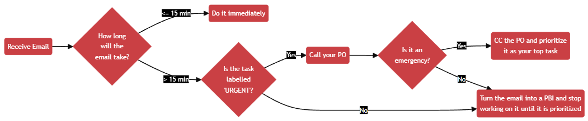
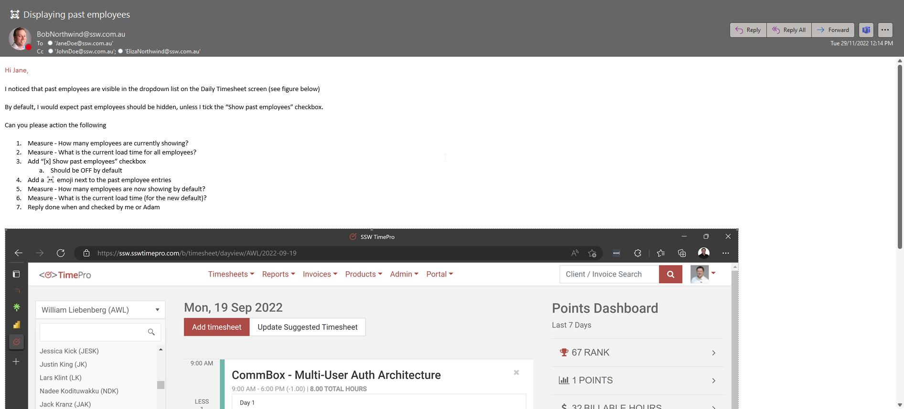

Emails are a natural way for people to give feedback about a product. Unfortunately, they also serve as a poor mechanism for performing work. As work is done, the thread can become untenable by splitting off into multiple different threads and becoming buried among other emails.

That's why when a feedback email is received, it is important to turn it into a Product Backlog Item (PBI) and communicate that back to the sender.

If someone often sends email tasks rather than creating PBIs, kindly suggest they create PBIs directly to save time and keep workflows organized.

<!--endintro-->

## ✅ Benefits of turning emails into PBIs

There are several benefits of turning an email into a PBI including:

* Providing one source of truth  
* Better prioritization  
* Easily accessible by anyone in the team  

## When should the email become a PBI?

You should use your judgement to decide if the email needs to become a PBI. For example:

* Does the email contain 1 or more actionable tasks? If not, **do not** turn into an PBI
* Does the feedback contain confidential information that should not be on the backlog? If so, **do not** turn into an PBI
* Will the task take less than 15 minutes to complete? If so, **do not** turn into an PBI and follow the ["touch it once" principle](/the-touch-it-once-principle) and do it immediately
* Is the [emails marked urgent](/work-in-order-of-importance-aka-priorities)?  If so, **do not** turn into an PBI. Urgent emails should be done immediately unless they are clearly not an emergency

Use the following flow chart to determine if an urgent email should be turned into a PBI.

## New PBI - Steps to turn an email into a PBI

It's important that you follow the right steps so that the PBI contains all the information someone would need to find the original email thread, and also so that the original sender knows where the PBI is, and whether it has completed.

1. Create a PBI in the backlog and give it a name
2. Copy the **email header** into the top of the PBI, indent it and add the words "Based on email chain:" so that the email can be found later
3. If possible, replace the users with @mentions, if you'd like to keep those users informed
4. Fill out the Description
5. Ensure that the Product Owner is @mentioned in the PBI
6. Add an Acceptance Criteria: *"Reply 'Done' to all emails mentioned in this PBI and @mention the sender with 'Done'"*
7. Prioritize the PBI. If it is important, then it should be added at the top of the Product Backlog after the current Sprint items. Otherwise, you should make your best guess as to its priority.
8. Reply back to the original email saying: *"That's awesome feedback, we have a PBI for prioritization: {{ URL }}\
   For future issues, if you have access, please add your comments to items in that backlog 🙂"*

::: greybox
Based on email chain:

**From:** Bob Northwind "[BobNorthwind@northwind.com](mailto:BobNorthwind@northwind.com)"\
**Sent:** Thursday, 24 November 2023\
**To:** Jane Doe "[JaneDoe@northwind.com](mailto:JaneDoe@northwind.com)"\
**Cc:** John Davis "[JohnDavis@northwind.com](mailto:JohnDavis@northwind.com)"; Eliza Northwind "[ElizaNorthwind@northwind.com](mailto:ElizaNorthwind@northwind.com)"\
**Subject:** TimePro PBI 50209: ☠️ Displaying past employees
:::
::: ok
Figure: OK example - Has the email header data but not @mentioning users
:::

::: greybox
Based on email chain:

**From:** @BobNorthwind\
**Sent:** Thursday, 24 November 2023\
**To:** @JaneDoe\
**Cc:** @JohnDavis @ElizaNorthwind\
**Subject:** TimePro PBI 50209: ☠️ Displaying past employees
:::
::: good
Figure: Good example - Has the email header data and @mentions users
:::

::: info
**Tip:** If the request from the client is too large for one PBI, then it will need to be turned into multiple PBIs as per the rule  [Do you keep your PBIs smaller than 2 days' effort?](/spec-do-you-create-tasks-under-4-hours) In this case, you will need to let the client know this and include URLs to each PBI
:::

## Existing PBI - Steps to update a PBI according to an email comment

Sometimes you'll receive feedback on an existing PBI in an email or a Word document. Make sure those files are attached to the corresponding PBI, and let the sender know once it's done.

1. Copy the **email header** into to a comment within the PBI, indent it and add the words "Based on email chain:"
2. If possible, replace the users with @mentions, if you'd like to keep those users informed
3. Add an Acceptance Criteria: *"Reply 'Done' to all emails mentioned in this PBI and @mention the sender with 'Done'"*

## Keeping the PBI up-to-date

If there is more communication in emails at a later date, it's important to make sure the PBI stays in sync with the emails. Otherwise, the source of truth will become confusing since there will be differing information in 2 places.

When there is a new update in emails do the following ASAP:

1. Update the PBI with any relevant information
2. Mention that it was updated as per the email thread in the discussion

::: bad

:::

::: good

:::

## Escalating key updates after completing a PBI

Once you’ve turned an email into a PBI and the work is complete, it’s crucial to ensure that all relevant stakeholders are informed about key updates or deliverables.

Refer to rule on [escalating key updates and deliverables](/escalate-key-updates) for guidance on how to share critical updates effectively.

For example:

* After completing a Done Video or resolving a major issue, communicate results via email to ensure visibility
* Use emails for high-priority updates that require stakeholder attention
* Keep @mentions in PBIs for less critical updates

This ensures a seamless workflow from task creation to stakeholder communication, preventing updates from being missed.

## Turn emails into tickets

If you use a ticketing system like Zendesk, you should follow a similar process to the above to turn emails with tasks into tickets.

1. Reply All to the email, add "(zendesking)" to the top and remind the sender that the email should have been sent to Zendesk instead, e.g. "Please remember to send tasks to our Zendesk address in the future :)"
2. CC your Zendesk email address on the reply - no need to copy the header info, since this will already be included
3. When the task is done (or if there are other updates), reply in Zendesk - the email will go to everyone originally included in the email

::: email-template

|          |     |
| -------- | --- |
| To:      | Bob |
| Cc:      | Tim, [SysAdmins@northwind.zendesk.com](mailto:SysAdmins@northwind.zendesk.com) |
| Subject: | Re: Add me to Azure DevOps |
::: email-content  

(zendesking)

### Hi Bob

&nbsp;&nbsp;&nbsp;&nbsp;> 1. Could you please add me to Azure DevOps?

Thanks for sending this through. Please remember to send tasks to our Zendesk address in the future :).

&dash; Chris

:::
:::
::: good
Figure: Good example - send it to Zendesk!
:::
