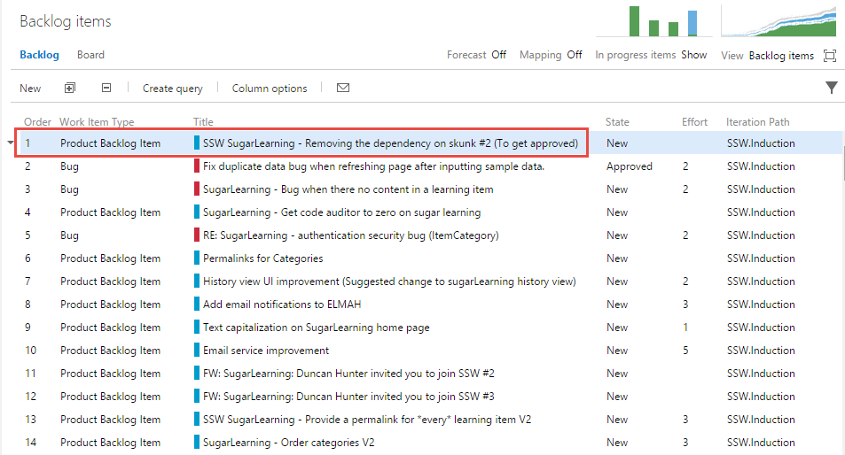

​​​If a product owner sends an email to the development team with a request, that email should be turned into an Azure DevOps Work Item before any work is started or the work is prioritized on the backlog. 
 <excerpt class='endintro'></excerpt> 
<dl>
​If the email's contents or subject do not need changing, then no response email is required. This would create another unnecessary email in the world. 
</dl>
However, if the subject is unclear, send a response as per the rules <a href=/do-you-know-when-you-should-change-a-subject>Do you know when you should change a subject? </a> and <a href=/do-you-realize-the-importance-of-a-good-email-subject>Do you realize the importance of a good email Subject?</a> 

If the request from the client is too large for one Work Item, then it will need to be turned into multiple Work Items as per the rule  <a href=/spec-do-you-create-tasks-under-4-hours>Do you keep your PBIs smaller than 2 days' effort?</a> In this case, you will need to let the client know this and include URLs to each Work Item.

 
   <strong>Note:</strong> Once you've moved the email into Azure DevOps as a work item, you should delete the original email from your inbox or move it to an Outlook folder called "Moved to Azure DevOps" to avoid duplication.​ 
    
<dl class="image"><dt> 
       
   </dt><dd>Figure: Now the new Product Backlog Item is in the Product Backlog​​ </dd></dl><h3>​Related rules</h3><ul><li><a href=/do-you-know-the-3-steps-to-a-pbi>Do you know the 3 steps to a PBI?</a></li><li><a href=/when-you-use-mentions-in-a-pbi>Do you know when you use @ mentions in a PBI?</a> </li></ul>

