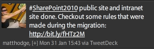

Your tweets should be interesting to your target audience. People aren't going to follow you for long if you make off topic and low value tweets.

<!--endintro-->
<dl class="badImage">&lt;dt&gt;&lt;/dt&gt;<dd> Bad Example - "Having lunch" is not an interesting tweet  </dd></dl>
Some good examples of things to tweet about:

* 1 day before an event, tweet about the event and what you are talking about
* On the day of the event, check-in on foursquare when you arrive (gives people a nice map)
* When something good happens to you, eg. you beat your boss in an arm wrestle
* Tweet before and after installing new software or after an upgrade eg:

    * Installing #SharePoint for the first time
    * #SharePoint install done - found a great guide to follow here: www.example.com

<dl class="goodImage">&lt;dt&gt;&lt;/dt&gt;<dd>Good Example - An informative tweet with hashtags which appeals to a targeted audience of IT followers</dd> 
</dl>
