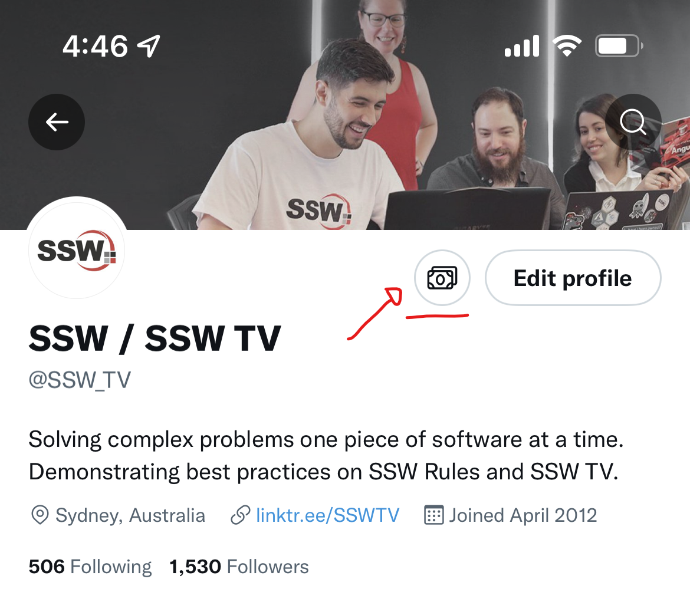

['Tips', from Twitter](https://help.twitter.com/en/using-twitter/tips), is a recently released feature that allows users to tip great content creators that they follow to show support and encourage them to keep creating content.      

<!--endintro-->

You can use 'Tip' to anyone you follow that has enabled this feature in their Twitter account, from journalists to digital influencers, and more. Tips can be sent in the form of money or Bitcoin via third-party payment services, which may charge fees.

Tips is only available for users on iOS and Android for now. To tip someone, just check first if they have a little money icon on their Twitter profile pages. For Android users, you can also find it on their profile while in [Twitter Spaces.](https://help.twitter.com/en/using-twitter/spaces)

