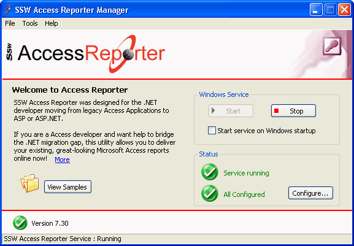
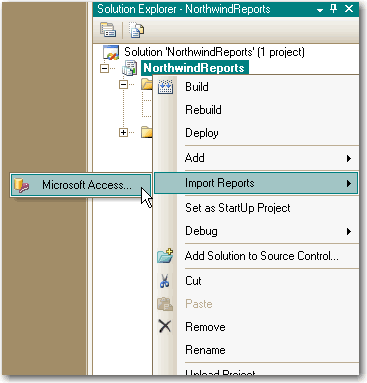

<!--endintro-->

The greatest advantage for Access Developers is that with Reporting Services your reports can become available on the web. If you have a heap of Access reports, what are the choices for getting them on the web?

1. Keep the existing reports in Access and expose them on the web with [SSW Access Reporter](https://ssw.com.au/ssw/accessreporter/). This is the least amount of work, as SSW Access Reporter is a utility that delivers existing Access reports online with minimal re-coding. [Download a free trial](https://ssw.com.au/ssw/accessreporter/) today and try it out for yourself.

::: good  

:::

2. Import the reports into Reporting Services. Reporting Services has built-in support for importing and converting reports from Access. We have had plenty of success with it, but you will need to re-code things like conditional formatting and any code behind.

::: good  

:::
